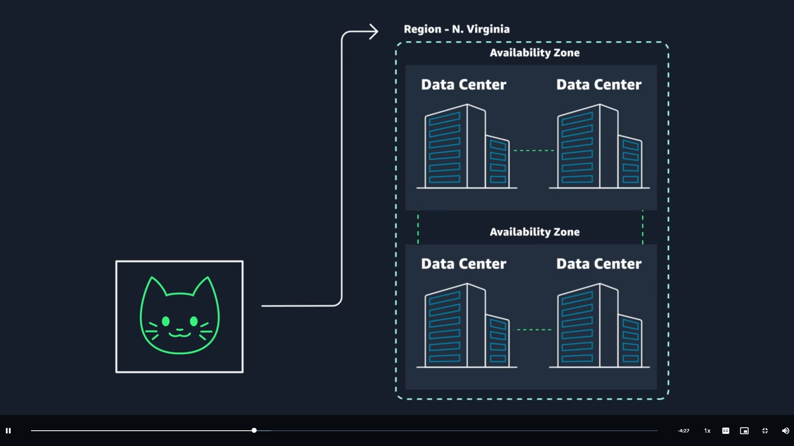

# AWS Global Infrastructure

## <u>I. Region, cluster of Available Zone (AZ), Data Center</u>

- AWS store data in a Data Center, and they have redundant Data Center that together form an Available Zone (AZ). Similarly, multiple AZ form a Region.
  

- AWS Region considerations
  - **Compliance**: depends on company requirements (data center in UK boundaries, etc.)
  - **Latency**: how close IT resources to user base
  - **Pricing**: vary from region to region
  - **Service availability**: some services might only available in some regions
- Scope of AWS services
  - Deploy services at AZ, Region or Global level depends on the service
  - With Region-scoped service, AWS auto performs actions to increase data durability and availability
  - With AZ, you are responsible for those actions
- Edge locations: global locations at the edge of a region where content is cached
