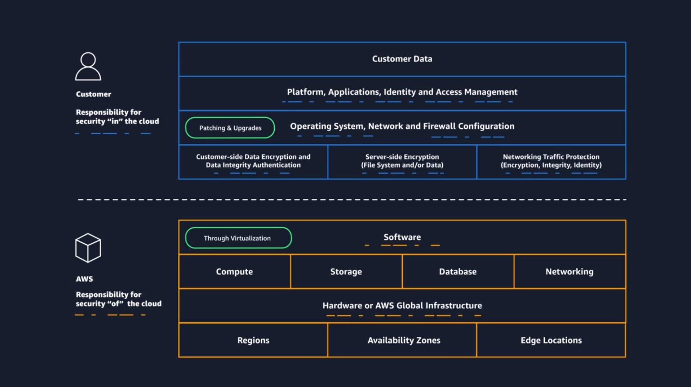

# AWS Shared Responsibility Model

## <u>I. Security</u>

User and AWS both are responsible for securing AWS environment.

- AWS is responsible for security `OF` the clould. (Protect and secure the infrastructure)

  - Protecting and securing AWS Regions, AZs, Data centers, down to physical security of the buildings.
  - Managing the hardware, software, and networking components that run AWS services, such as the physical servers, host operating systems, virtualization layers, and AWS networking components.

  | Category                | Examples                                                                                                          | AWS Responsibility                                                                                                                 |
  | ----------------------- | ----------------------------------------------------------------------------------------------------------------- | ---------------------------------------------------------------------------------------------------------------------------------- |
  | Infrastructure services | Compute services, such as Amazon Elastic Compute Cloud (Amazon EC2)                                               | AWS manages the underlying infrastructure and foundation services.                                                                 |
  | Abstracted services     | Services that require very little management from the customer, such as Amazon Simple Storage Service (Amazon S3) | AWS operates the infrastructure layer, operating system, and platforms, in addition to server-side encryption and data protection. |

- Customers are responsible for security `IN` the cloud. (Properly configuring the service and their applications, ensuring their data is secure)

  | Category                | Examples                                                                                                          | Customers Responsibility                                                                                                             |
  | ----------------------- | ----------------------------------------------------------------------------------------------------------------- | ------------------------------------------------------------------------------------------------------------------------------------ |
  | Infrastructure services | Compute services, such as Amazon Elastic Compute Cloud (Amazon EC2)                                               | Customers' control the operating system and application platform, in addition to encrypting, protecting, and managing customer data. |
  | Abstracted services     | Services that require very little management from the customer, such as Amazon Simple Storage Service (Amazon S3) | Customers' are responsible for customer data, encrypting the data, and protecting it through network firewalls and backups.          |
