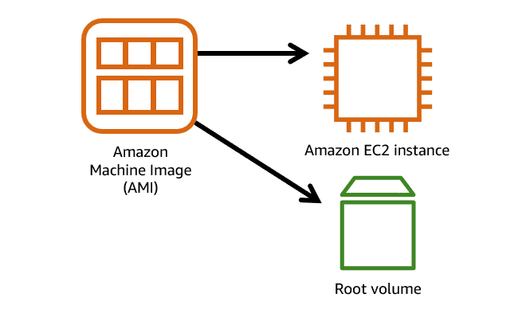
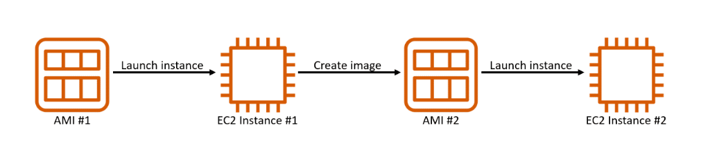
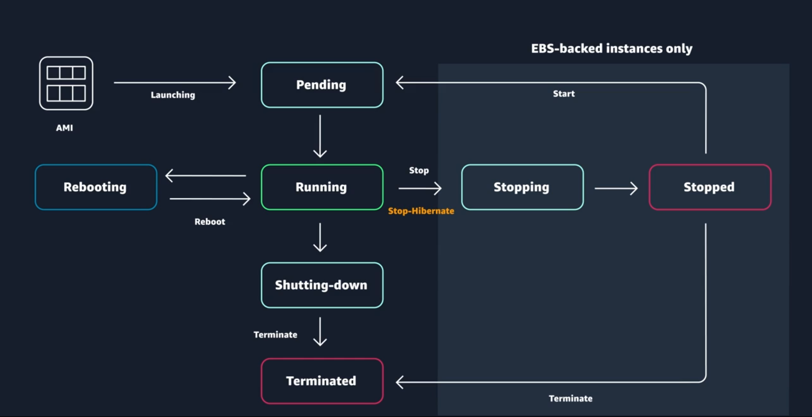

# AWS EC2

When architecting any application for high availability, consider using at least two EC2 instances in two separate Availability Zones.

Amazon EC2 is a web service that provides secure, resizable compute capacity in the cloud. With this service, you can provision virtual servers called EC2 instances.

With Amazon EC2, you can do the following:

- Provision and launch one or more EC2 instances in minutes.
- Stop or shut down EC2 instances when you finish running a workload.
- Pay by the hour or second for each instance type (minimum of 60 seconds).

To create an EC2 instance, you must define the following:

- **Hardware specifications**: CPU, memory, network, and storage
- **Logical configurations**: Networking location, firewall rules, authentication, and the operating system of your choice

## <u>I. Amazon Machine Image (AMI)</u>

An AMI includes the operating system, storage mapping, architecture type, launch permissions, and any additional preinstalled software applications.

One advantage of using AMIs is that they are reusable.

There are multiple ways to select an AMI:

- Quick Start AMIs are commonly used AMIs created by AWS that you can select to get started quickly.
- AWS Marketplace AMIs provide popular open-source and commercial software from third-party vendors.
- My AMIs are created from your EC2 instances.
- Community AMIs are provided by the AWS user community.
- Build your own custom image with EC2 Image Builder.

## <u>II. Amazon EC2 instance types</u>

EC2 instances are a combination of virtual processors (vCPUs), memory, network, and, in some cases, instance storage and graphics processing units (GPUs). When you create an EC2 instance, you need to choose how much you need of each of these components.

Instance types consist of a prefix identifying the type of workloads they’re optimized for, followed by a size.  
For example, the instance type c5n.xlarge can be broken down as follows:

- **First position** – The first position, `c`, indicates the instance family. This indicates that this instance belongs to the compute optimized family.
- **Second position** – The second position, `5`, indicates the generation of the instance. This instance belongs to the fifth generation of instances.
- **Remaining letters before the period** – In this case, `n` indicates additional attributes, such as local NVMe storage.
- **After the period** – After the period, `xlarge` indicates the instance size. In this example, it's xlarge.

## <u>III. Instance families</u>

Each instance family is optimized to fit different use cases. The following table describes instance families and some typical workloads.

| Instance family       | Description                                                                                                                                                                                                                                                                                                                | Use Cases                                                                                                                                                                                                                                                                |
| --------------------- | -------------------------------------------------------------------------------------------------------------------------------------------------------------------------------------------------------------------------------------------------------------------------------------------------------------------------- | ------------------------------------------------------------------------------------------------------------------------------------------------------------------------------------------------------------------------------------------------------------------------ |
| General purpose       | General purpose instances provide a balance of compute, memory, and networking resources, and can be used for a variety of workloads.                                                                                                                                                                                      | Ideal for applications that use these resources in equal proportions, such as web servers and code repositories                                                                                                                                                          |
| Compute optimized     | Compute optimized instances are ideal for compute-bound applications that benefit from high-performance processors.                                                                                                                                                                                                        | Well-suited for batch processing workloads, media transcoding, high performance web servers, high performance computing (HPC), scientific modeling, dedicated gaming servers and ad server engines, machine learning inference, and other compute intensive applications |
| Memory optimized      | Memory optimized instances are designed to deliver fast performance for workloads that process large datasets in memory.                                                                                                                                                                                                   | Memory-intensive applications, such as high-performance databases, distributed web-scale in-memory caches, mid-size in-memory databases, real-time big-data analytics, and other enterprise applications                                                                 |
| Accelerated computing | Accelerated computing instances use hardware accelerators or co-processors to perform functions such as floating-point number calculations, graphics processing, or data pattern matching more efficiently than is possible in software running on CPUs.                                                                   | Machine learning, HPC, computational fluid dynamics, computational finance, seismic analysis, speech recognition, autonomous vehicles, and drug discovery                                                                                                                |
| Storage optimized     | Storage optimized instances are designed for workloads that require high sequential read and write access to large datasets on local storage. They are optimized to deliver tens of thousands of low-latency random I/O operations per second (IOPS) to applications that replicate their data across different instances. | NoSQL databases (Cassandra, MongoDB and Redis), in-memory databases, scale-out transactional databases, data warehousing, Elasticsearch, and analytics                                                                                                                   |
| HPC optimized         | High performance computing (HPC) instances are purpose built to offer the best price performance for running HPC workloads at scale on AWS.                                                                                                                                                                                | Ideal for applications that benefit from high-performance processors, such as large, complex simulations and deep learning workloads                                                                                                                                     |

## <u>IV. EC2 Instance lifecycle</u>

### 1. Difference between stop and stop-hibernate

- When you stop an instance, it enters the stopping state until it reaches the stopped state. AWS does not charge usage or data transfer fees for your instance after you stop it. But storage for any Amazon EBS volumes is still charged. While your instance is in the stopped state, you can modify some attributes, like the instance type. When you stop your instance, the data from the instance memory (RAM) is lost.

- When you stop-hibernate an instance, Amazon EC2 signals the operating system to perform hibernation (suspend-to-disk), which saves the contents from the instance memory (RAM) to the EBS root volume. You can hibernate an instance only if hibernation is turned on and the instance meets the hibernation prerequisites.

### 2. Pricing

One of the ways to reduce costs with Amazon EC2 is to choose the right pricing option for the way that your applications run.

- **On-Demand Instances**: With On-Demand Instances, you pay for compute capacity per hour or per second, depending on which instances that you run. Recommended for these use cases.
  - Users who prefer the low cost and flexibility of Amazon EC2 without upfront payment or long-term commitments
  - Applications with short-term, spiky, or unpredictable workloads that cannot be interrupted
  - Applications being developed or tested on Amazon EC2 for the first time
- **Spot Instances**: For applications that have flexible start and end times, you can request spare Amazon EC2 computing capacity for up to 90 percent off the On-Demand price (`you set a limit on how much you want to pay for the instance hour`). Recommended for these use cases.
  - Applications that have flexible start and end times
  - Applications that are only feasible at very low compute prices
  - Users with fault-tolerant or stateless workloads
- **Saving Plans**: Flexible pricing model that offers low usage prices for a 1-year or 3-year term commitment to a consistent amount of usage (Apply to EC2, Lambda, Fargate, up to 72% savings on compute usage). Recommended for these use cases.
  - Workloads with a consistent and steady-state usage
  - Customers who want to use different instance types and compute solutions across different locations
  - Customers who can make monetary commitment to use Amazon EC2 over a 1-year or 3-year term
- **Reserved Instances**: For applications with steady state usage that might require reserved capacity (save up to 75%). 3 payment options: All Upfront, Partial Upfront, or No Upfron (1-year or 3-year).
  - Standard Reserved Instances: These provide the most significant discount (up to 72 percent off On-Demand pricing) and are best suited for steady-state usage.
  - Convertible Reserved Instances: These provide a discount (up to 54 percent off On-Demand pricing) and the capability to change the attributes of the Reserved Instance if the exchange results in the creation of Reserved Instances of equal or greater value. Like Standard Reserved Instances, Convertible Reserved Instances are best suited for steady-state usage.
  - Scheduled Reserved Instances: These are available to launch within the time windows that you reserve. With this option, you can match your capacity reservation to a predictable recurring schedule that only requires a fraction of a day, a week, or a month.
- **Dedicated Hosts**: Physical Amazon EC2 server that is dedicated for your use (`help meet compliance requirements`). Amazon EC2 Dedicated Host is also integrated with AWS License Manager, a service that helps you manage your software licenses, including Microsoft Windows Server and Microsoft SQL Server licenses.
  - Dedicated Hosts can be purchased on demand (hourly).
  - Dedicated Hosts can be purchased as a Reservation for up to 70 percent off the On-Demand price.
