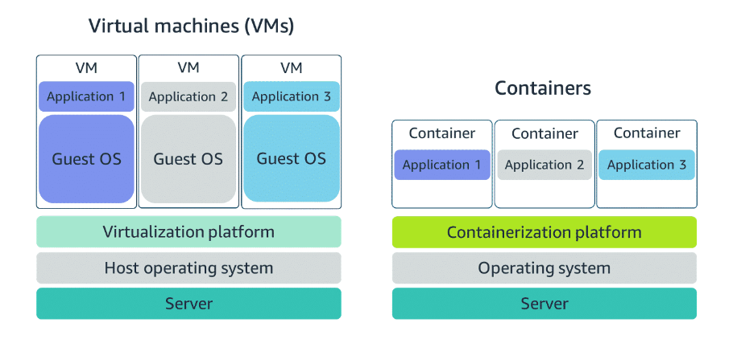
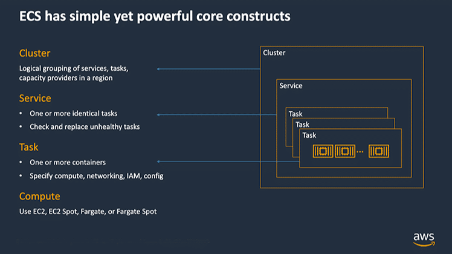
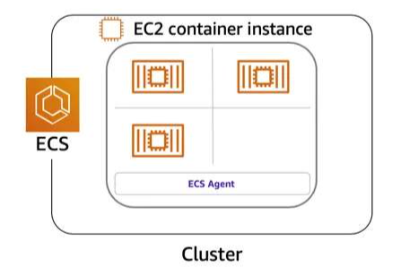

# Container Services

## <u>I. Difference between VMs and containers</u>



Compared to virtual machines (VMs), containers share the same operating system and kernel as the host that they are deployed on.

Virtual machines contain their own OS. Each must maintain a copy of the OS <br>
-> `wasted resources`.

Container is more lightweight. It spin up quicker (almost instantly). <br>
=> `Instrumental for applications that must scale quickly`.

**Containers provide speed** <br>
**VMs offer full strength of OS (more resources, dedicated kernel, etc.)**

## <u>II. Orchestrating containers</u>

In AWS, containers can run on EC2 instances. Best practice is to run many containers on many EC2 instances across several Availability Zones.

If you’re trying to manage your compute at a large scale, you should consider the following:

- How to place your containers on your instances
- What happens if your container fails
- What happens if your instance fails
- How to monitor deployments of your containers

This coordination is handled by a container orchestration service. AWS offers two container orchestration services: **Amazon Elastic Container Service (Amazon ECS)** and **Amazon Elastic Kubernetes Service (Amazon EKS)**.

## <u>III. Managing containers with Amazon ECS</u>

Amazon ECS is an end-to-end container orchestration service that helps you spin up new containers.

Containers are defined in a task definition used to run individual task or a task within a service.

- Can be run on a serverless infrastructure managed by another AWS service: `AWS Fargate`
- For more control over infrastructure, run on a cluster of EC2 instances `(Need to install ECS container agent)` <br>
  => **Container instance.** Container agent is responsible to communicate to ECS service about cluster management details. (Linux and Windows AMIs)





ECS container instace actions `(include but not limit)`:

- Launching and stopping containers
- Getting cluster state
- Scaling in and out
- Scheduling the placement of containers across your cluster
- Assigning permissions
- Meeting availability requirements

**Preparation:** need a task definition (text file, JSON format, similar to blueprint that describes resources)

```
{
"family": "webserver",
"containerDefinitions": [ {
"name": "web",
"image": "nginx",
"memory": "100",
"cpu": "99"
} ],
"requiresCompatibilities": [ "FARGATE" ],
"networkMode": "awsvpc",
"memory": "512",
"cpu": "256"
}
```

## <u>IV. Using Kubernetes with Amazon EKS</u>

Kubernetes is a portable, extensible, open-source platform for managing containerized workloads and services. By bringing software development and operations together by design, Kubernetes created a rapidly growing ecosystem that is very popular and well established in the market.

Amazon EKS is a managed service that you can use to run Kubernetes on AWS without needing to install, operate, and maintain your own Kubernetes control plane or nodes.

Difference from ECS:

- In Amazon ECS, the machine that runs the containers is an EC2 instance that has an ECS agent installed and configured to run and manage your containers. This instance is called a container instance. In Amazon EKS, the machine that runs the containers is called a worker node or Kubernetes node.
- An ECS container is called a task. An EKS container is called a pod.
- Amazon ECS runs on AWS native technology. Amazon EKS runs on Kubernetes.

**EKS could be the tool for containers already run on K8s and want an advanced orchestration solution providing simplicity, high availability, and fine-grained control.**
