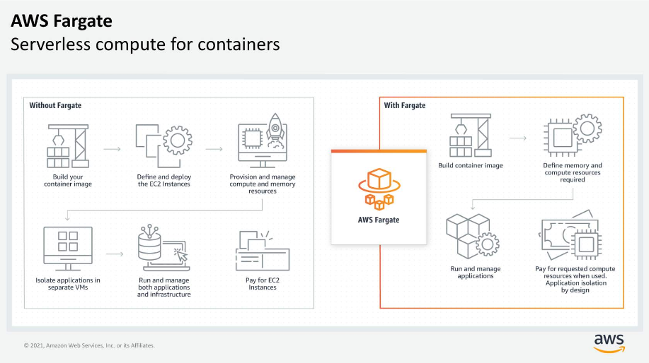

# Serverless with AWS Fargate

AWS Fargate scales and manages the infrastructure, so developers can work on what they do best, application development.

## <u>I. Exploring serverless containers with AWS Fargate</u>

Fargate abstracts the EC2 instance so that you’re not required to manage the underlying compute infrastructure, but can still use the same AWS concepts like ECS, APIs, integrations.

Native integration with IAM and VPC, can launch Fargate containers inside network and control connectivity.

AWS Fargate is a purpose-built serverless compute engine for containers. It scales and manages infrastructure, achieved by allocating right amount of compute.

Fargate eliminates the need to choose and manage EC2 instances, cluster capacity, and scaling. It supports both Amazon ECS and Amazon EKS architecture and provides workload isolation and improved security by design.

