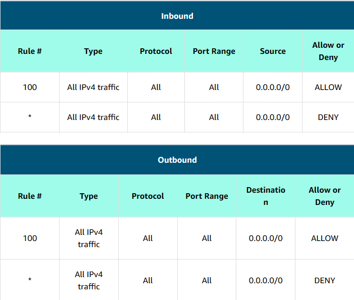
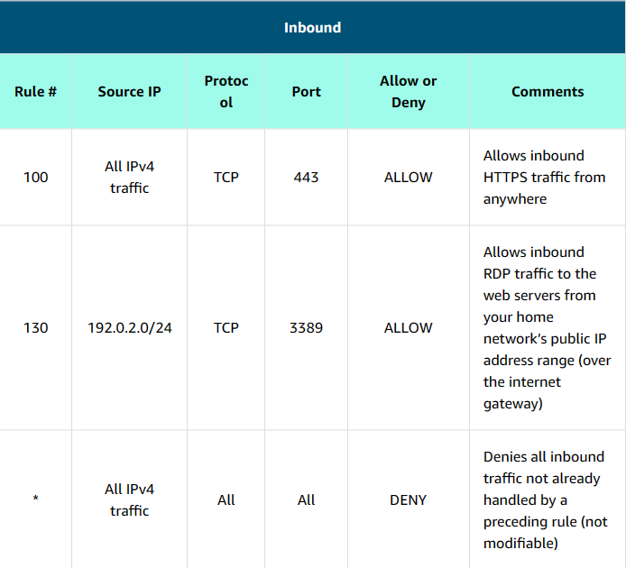
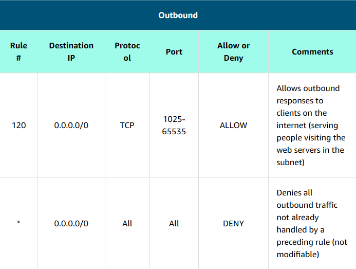
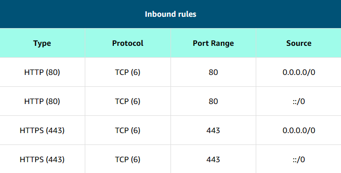

# Amazon VPC Security

Cloud security at AWS is the highest priority. You benefit from a data center and network architecture that is built to meet the requirements of the most security-sensitive organizations.

## <u>I. Secure subnets with network access control lists</u>

Think of a network access control list (network ACL) as a virtual firewall at the `subnet level`. A network ACL lets you control what kind of traffic is allowed to enter or leave your subnet. You can configure this by setting up rules that define what you want to filter. Here is an example of a default ACL for a VPC that supports IPv4.

### **Default network ACL**

The default network ACL shown in the preceding table, allows all traffic in and out of the subnet. To allow data to flow freely to the subnet, this is a good starting place.

However, you might want to restrict data at the subnet level. For example, if you have a web application, you might restrict your network to allow HTTPS traffic and Remote Desktop Protocol (RDP) traffic to your web servers.

### **Custom network ACL**

Notice that in the custom network ACL in the preceding example, you allow inbound 443 and outbound range 1025–65535. That’s because HTTPS uses port 443 to initiate a connection and will respond to an ephemeral port. Network ACLs are considered `stateless`, so you need to include both the inbound and outbound ports used for the protocol. If you don’t include the outbound range, your server would respond but the traffic would never leave the subnet.

Because network ACLs are configured by default to allow incoming and outgoing traffic, you don’t need to change their initial settings unless you need additional security layers.

## <u>II. Secure EC2 instances with security groups</u>

The next layer of security is a virtual firewall called a security group for EC2 instances. The default configuration of a security group blocks all inbound traffic and allows all outbound traffic.

By default, a security group only allows outbound traffic. To allow inbound traffic, you must create inbound rules.

Security groups are `stateful`, it will remember if a connection is originally initiated by the EC2 instance or from the outside, and temporarily allow traffic to respond without modifying the inbound rules.

If you want your EC2 instance to accept traffic from the internet, you must open up inbound ports. (80 for HTTP, 443 for HTTPS, etc.)

### **Security group inbound rules**

Subnets can be used to segregate traffic between computers in your network. Security groups can be used in the same way. A common design pattern is to organize resources into different groups and create security groups for each to control network communication between them.

This example defines three tiers and isolates each tier with defined security group rules. In this case, internet traffic to the web tier is allowed over HTTPS. Web tier to application tier traffic is allowed over HTTP, and application tier to database tier traffic is allowed over MySQL. This is different from traditional on-premises environments, in which you isolate groups of resources with a VLAN configuration. In AWS, security groups allow you to achieve the same isolation without tying the security groups to your network.
