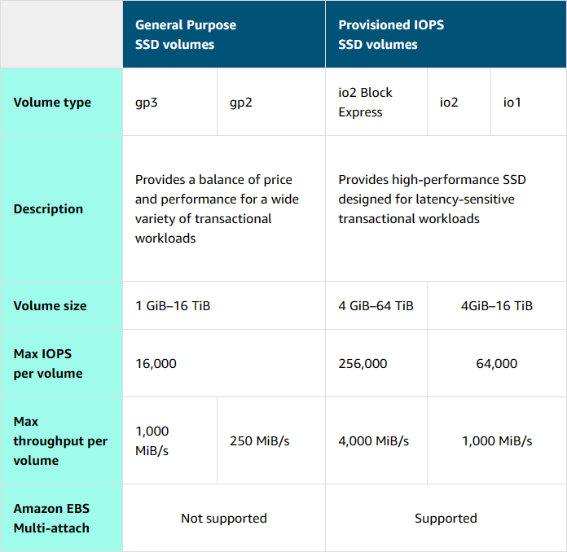
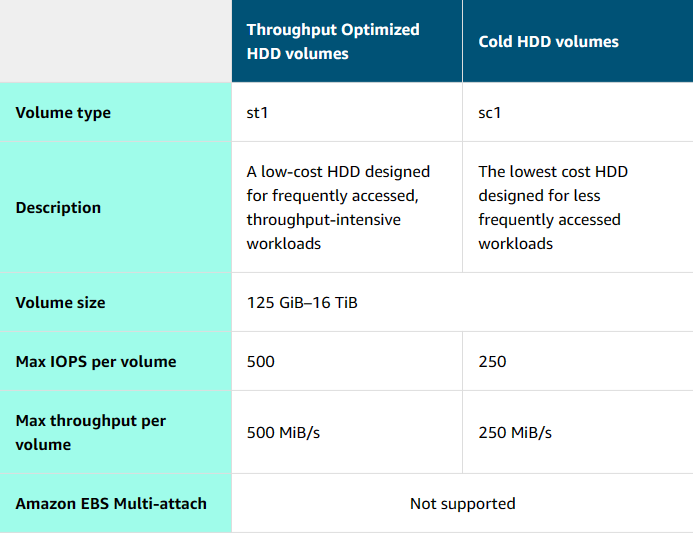

# Block Storage with Amazon EC2 Instance Store and Amazon EBS

The unique characteristics of block storage make it the preferred option for transactional, mission-critical, and I/O-intensive applications.

## <u>I. Amazon EC2 instance store</u>

Amazon Elastic Compute Cloud (Amazon EC2) instance store provides temporary block-level storage for an instance. This storage is located on disks that are physically attached to the host computer. This ties the lifecycle of the data to the lifecycle of the EC2 instance. If you delete the instance, the instance store is also deleted. Because of this, instance store is considered ephemeral storage.

Instance store is ideal if you host applications that replicate data to other EC2 instances, such as Hadoop clusters. For these cluster-based workloads, having the speed of locally attached volumes and the resiliency of replicated data helps you achieve data distribution at high performance. It’s also ideal for temporary storage of information that changes frequently, such as buffers, caches, scratch data, and other temporary content.

## <u>II. Amazon EBS</u>

As the name implies, Amazon Elastic Block Store (Amazon EBS) is block-level storage that you can attach to an Amazon EC2 instance (attach external drive to laptop). This attachable storage is called an EBS volume. EBS volumes act similarly to external drives in more than one way.
- **Detachable**: You can detach an EBS volume from one EC2 instance and attach it to another EC2 instance in the same Availability Zone to access the data on it.
- **Distinct**: The external drive is separate from the computer. That means that if an accident occurs and the computer goes down, you still have your data on your external drive. The same is true for EBS volumes.
- **Size-limited**: You’re limited to the size of the external drive, because it has a fixed limit to how scalable it can be. For example, you might have a 2 TB external drive, which means you can only have 2 TB of content on it. This also relates to Amazon EBS, because a volume also has a max limitation of how much content you can store on it.
- **1-to-1 connection**: Most EBS volumes can only be connected with one computer at a time. Most EBS volumes have a one-to-one relationship with EC2 instances, so they cannot be shared by or attached to multiple instances at one time.

> `NOTICE`  
AWS announced the Amazon EBS multi-attach feature that permits Provisioned IOPS SSD (io1 or io2) volumes to be attached to multiple EC2 instances at one time. This feature is not available for all instance types, and all instances must be in the same Availability Zone.

### **Scaling Amazon EBS volumes**

- **Increase volume size** only if it doesn’t increase above the maximum size limit. Depending on the volume selected, Amazon EBS currently supports a maximum volume size of 64 tebibytes (TiB). For example, if you provision a 5-TiB io2 Block Express volume, you can choose to increase the size of your volume until you get to 64 TiB.
- **Attach multiple volumes** to a single EC2 instance. Amazon EC2 has a one-to-many relationship with EBS volumes. You can add these additional volumes during or after EC2 instance creation to provide more storage capacity for your hosts.

### **Use cases**

Amazon EBS is useful when you must retrieve data quickly and have data persist long term.

- **Operating systems**: Boot and root volumes can be used to store an operating system. The root device for an instance launched from an Amazon Machine Image (AMI) is typically an EBS volume. These are commonly referred to as EBS-backed AMIs.
- **Databases**: As a storage layer for databases running on Amazon EC2 that will scale with your performance needs and provide consistent and low-latency performance.
- **Enterprise applications**: Amazon EBS provides high availability and high durability block storage to run business-critical applications.
- **Big data analytics engines**: Amazon EBS offers data persistence, dynamic performance adjustments, and the ability to detach and reattach volumes, so you can resize clusters for big data analytics.

### **Volume types**

EBS volumes are organized into two main categories: solid-state drives (SSDs) and hard-disk drives (HDDs). SSDs are used for transactional workloads with frequent read/write operations with small I/O size. HDDs are used for large streaming workloads that need high throughput performance. AWS offers two types of each.

- SSD volumes: 
- HDD volumes: 

### **Benefits**

- **High availability**: When you create an EBS volume, it is automatically replicated in its Availability Zone to prevent data loss from single points of failure.
- **Data persistence**: Storage persists even when your instance doesn’t.
- **Data encryption**: When activated by the user, all EBS volumes support encryption. 
- **Flexibility**: EBS volumes support on-the-fly changes. Modify volume type, volume size, and input/output operations per second (IOPS) capacity without stopping your instance.
- **Backups**: Amazon EBS provides the ability to create backups of any EBS volume.

### **Snapshots**

Errors happen. One error is not backing up data and then inevitably losing it. To prevent this from happening to you, always back up your data, even in AWS. Because your EBS volumes consist of the data from your EC2 instance, you should make backups of these volumes, called snapshots.

EBS snapshots are incremental backups that only save the blocks on the volume that have changed after your most recent snapshot. For example, if you have 10 GB of data on a volume and only 2 GB of data have been modified since your last snapshot, only the 2 GB that have been changed are written to Amazon S3.

When you take a snapshot of any of your EBS volumes, the backups are stored redundantly in multiple Availability Zones using Amazon S3. This aspect of storing the backup in Amazon S3 is handled by AWS, so you won’t need to interact with Amazon S3 to work with your EBS snapshots. You manage them in the Amazon EBS console, which is part of the Amazon EC2 console.

EBS snapshots can be used to create multiple new volumes, whether they’re in the same Availability Zone or a different one. When you create a new volume from a snapshot, it’s an exact copy of the original volume at the time the snapshot was taken.