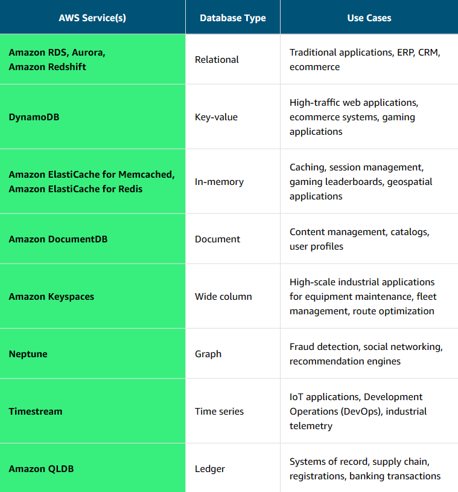

# Choosing the Right Database Service

Choose the database service that is the best fit for the job to help you optimize scale, performance, and costs when designing applications.

## <u>I. AWS database services</u>

## <u>II. Breaking up applications and databases</u>

As the industry changes, applications and databases change too. Today, with larger applications, you no longer see just one database supporting them. Instead, applications are broken into smaller services, each with its own purpose-built database supporting it. This shift removes the idea of a one-size-fits-all database and replaces it with a complimentary database strategy. You can give each database the appropriate functionality, performance, and scale the workload requires.
