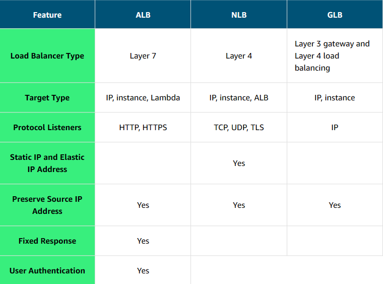

# Traffic Routing with Elastic Load Balancing

The Elastic Load Balancing (ELB) service can distribute incoming application traffic across EC2 instances, containers, IP addresses, and Lambda functions.

## <u>I. Load balancers</u>

Load balancing refers to the process of distributing tasks across a set of resources. In the case of the Employee Directory application, the resources are EC2 instances that host the application, and the tasks are the requests being sent. You can use a load balancer to distribute the requests across all the servers hosting the application.

To do this, the load balancer needs to take all the traffic and redirect it to the backend servers based on an algorithm. The most popular algorithm is round robin, which sends the traffic to each server one after the other.

A typical request for an application starts from a client's browser. The request is sent to a load balancer. Then, it’s sent to one of the EC2 instances that hosts the application. The return traffic goes back through the load balancer and back to the client's browser.

Although it is possible to install your own software load balancing solution on EC2 instances, AWS provides the ELB service for you.

## <u>II. ELB features</u>

The ELB service provides a major advantage over using your own solution to do load balancing. Mainly, you don’t need to manage or operate ELB. It can distribute incoming application traffic across EC2 instances, containers, IP addresses, and Lambda functions. Other key features include the following:
- **Hybrid mode** – Because ELB can load balance to IP addresses, it can work in a hybrid mode, which means it also load balances to on-premises servers.
- **High availability** – ELB is highly available. The only option you must ensure is that the load balancer's targets are deployed across multiple Availability Zones.
- **Scalability** – In terms of scalability, ELB automatically scales to meet the demand of the incoming traffic. It handles the incoming traffic and sends it to your backend application.

## <u>III. Health checks</u>

Monitoring is an important part of load balancers because they should route traffic to only healthy EC2 instances. That’s why ELB supports two types of health checks as follows:
- Establishing a connection to a backend EC2 instance using TCP and marking the instance as available if the connection is successful.
- Making an HTTP or HTTPS request to a webpage that you specify and validating that an HTTP response code is returned.

Taking time to define an appropriate health check is critical. Only verifying that the port of an application is open doesn’t mean that the application is working. It also doesn’t mean that making a call to the home page of an application is the right way either.

For example, the Employee Directory application depends on a database and Amazon S3. The health check should validate all the elements. One way to do that is to create a monitoring webpage, such as `/monitor`. It will make a call to the database to ensure that it can connect, get data, and make a call to Amazon S3. Then, you point the health check on the load balancer to the `/monitor` page.

After determining the availability of a new EC2 instance, the load balancer starts sending traffic to it. If ELB determines that an EC2 instance is no longer working, it stops sending traffic to it and informs Amazon EC2 Auto Scaling. It is the responsibility of Amazon EC2 Auto Scaling to remove that instance from the group and replace it with a new EC2 instance. Traffic is only sent to the new instance if it passes the health check.

If Amazon EC2 Auto Scaling has a scaling policy that calls for a scale down action, it informs ELB that the EC2 instance will be terminated. ELB can prevent Amazon EC2 Auto Scaling from terminating an EC2 instance until all connections to the instance end. It also prevents any new connections. This feature is called connection draining. We will learn more about Amazon EC2 Auto Scaling in the next lesson.

## <u>IV. ELB components</u>

The ELB service is made up of three main components: rules, listeners, and target groups. 

- **Rule**: To associate a target group to a listener, you must use a rule. Rules are made up of 2 conditions. First is the source IP address of the client. Second is to decide which target group to send the traffic to.
- **Listener**: Client connects to the listener (client side). To define a listener, a port must be provided in addition to the protocol, depending on the load balancer type. There can be many listeners for a single load balancer.
- **Target group**: The backend servers (server side) are defined in 1 or more target groups. This is where you define the type of backend you want to direct traffic to, such as EC2 instances, Lambda functions, or IP addresses. Also, a health check must be defined for each target group.

## <u>V. Types of load balancers</u>

We will cover three types of load balancers: Application Load Balancer (ALB), Network Load Balancer (NLB), and Gateway Load Balancer (GLB). 

### **Application Load Balancer**

- User authorization
- Rich metrics and logging
- Redirects
- Fixed response

For our Employee Directory application, we are using an Application Load Balancer. An Application Load Balancer functions at Layer 7 of the Open Systems Interconnection (OSI) model. It is ideal for load balancing HTTP and HTTPS traffic. After the load balancer receives a request, it evaluates the listener rules in priority order to determine which rule to apply. It then routes traffic to targets based on the request content.

**Primary features**:
- **Routes traffic based on request data**: An Application Load Balancer makes routing decisions based on the HTTP and HTTPS protocol. For example, the ALB could use the URL path (/upload) and host, HTTP headers and method, or the source IP address of the client. This facilitates granular routing to target groups.
- **Sends responses directly to the client**: An Application Load Balancer can reply directly to the client with a fixed response, such as a custom HTML page. It can also send a redirect to the client. This is useful when you must redirect to a specific website or redirect a request from HTTP to HTTPS. It removes that work from your backend servers.
- **Uses TLS offloading**: An Application Load Balancer understands HTTPS traffic. To pass HTTPS traffic through an Application Load Balancer, an SSL certificate is provided one of the following ways:
    - Importing a certificate by way of IAM or ACM services
    - Creating a certificate for free using ACM

        This ensures that the traffic between the client and Application Load Balancer is encrypted.
- **Authenticates users**: An Application Load Balancer can authenticate users before they can pass through the load balancer. The Application Load Balancer uses the OpenID Connect (OIDC) protocol and integrates with other AWS services to support protocols, such as the following:
    - SAML
    - Lightweight Directory Access Protocol (LDAP)
    - Microsoft Active Directory
    - Others
- **Secures traffic**: To prevent traffic from reaching the load balancer, you configure a security group to specify the supported IP address ranges.
- **Supports sticky sessions**: If requests must be sent to the same backend server because the application is stateful, use the sticky session feature. This feature uses an HTTP cookie to remember which server to send the traffic to across connections.

### **Network Load Balancer**

- TCP and User Datagram Protocol (UDP) connection based
- Source IP preservation
- Low latency

A Network Load Balancer is ideal for load balancing TCP and UDP traffic. It functions at Layer 4 of the OSI model, routing connections from a target in the target group based on IP protocol data.

**Primary features**:
- **Sticky sessions**: Routes requests from the same client to the same target.
- **Low latency**: Offers low latency for latency-sensitive applications.
- **Source IP address**: Preserves the client-side source IP address.
- **Static IP support**: Automatically provides a static IP address per Availability Zone (subnet).
- **Elastic IP address support**: Lets users assign a custom, fixed IP address per Availability Zone (subnet).
- **DNS failover**: Uses Amazon Route 53 to direct traffic to load balancer nodes in other zones.

### **Gateway Load Balancer**

- Health checks
- Gateway Load Balancer Endpoints
- Higher availability for third-party virtual appliances

A Gateway Load Balancer helps you to deploy, scale, and manage your third-party appliances, such as firewalls, intrusion detection and prevention systems, and deep packet inspection systems. It provides a gateway for distributing traffic across multiple virtual appliances while scaling them up and down based on demand.

**Primary features**:
- **High availability**: Ensures high availability and reliability by routing traffic through healthy virtual appliances.
- **Monitoring**: Can be monitored using CloudWatch metrics.
- **Streamlined deployments**: Can deploy a new virtual appliance by selecting it in the AWS Marketplace.
- **Private connectivity**: Connects internet gateways, virtual private clouds (VPCs), and other network resources over a private network.

### **Selecting between ELB types**

You can select between the ELB service types by determining which feature is required for your application. The following table presents a list of some of the major features of load balancers.

