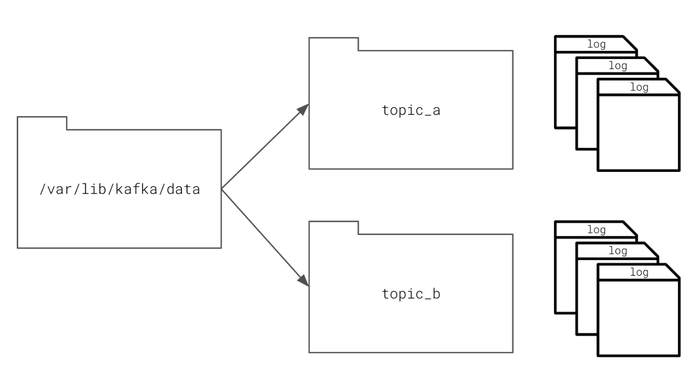

# How Kafka Stores Data

The way that Kafka stores data is pretty simple. It has a data directory on a disk where it stores logs of data and text files. `/var/lib/kafka/data` is a directory where Kafta sorts data in your workspace and in many Kafka productions systems.

- Each topic receives its own sub-directory with the associated name of the topic.
- Kafka may store more than one log file for a given topic

