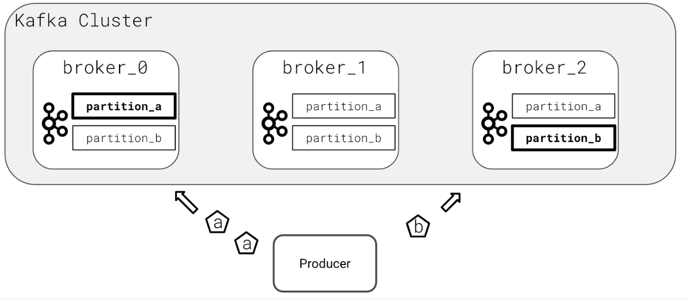

# Kafka Data Partitioning

## Message Ordering

Message ordering is only guaranteed within a partition in Kafka. If your topic has more than one partition, Kafka provides no guarantees that the messages will be consumed in the order they were produced. For many applications, this is an acceptable tradeoff for increasing the parallelism and speed of consumption. Your producer applications may still add metadata to the event header or message body itself to indicate ordering. However, this logic would belong to your application, and not Kafka itself. For example, you may place an increasing ID sequence in every message (eg 1, 2, 3, and so on) or a granular timestamp to indicate the order of a message.

