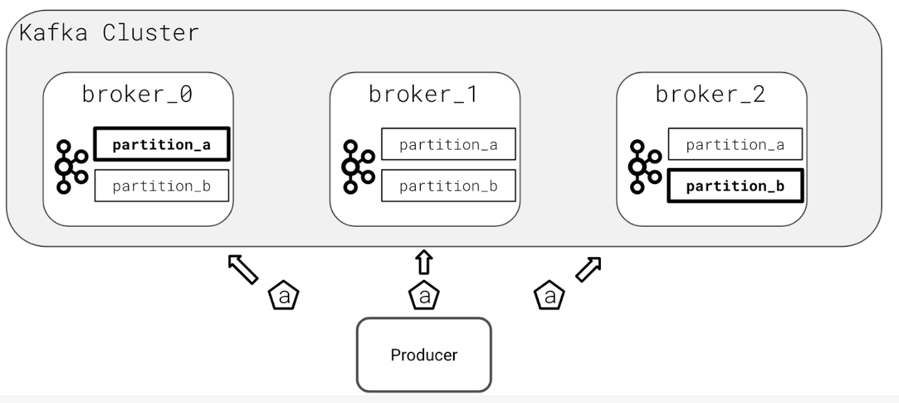

# Kafka Data Replication

## Preventing Data Loss

Based on an understanding that machines can fail, one of the core features of Kafka is the concept of replication.

- **Replication** – when the data is written to many brokers
- **Leader Broker** – the broker responsible for sending and receiving data to clients for a given topic partition
- **Replicas** – any brokers that are storing replicated data

If the leader broker were to fail, one of the replicas would be elected the new topic partition leader by a zookeeper election.

The exact number of replicas used can be configured globally as a Kafta server configuration item or set individually on every topic you create. But keep a few things in mind:

1. You can not have more replicas than brokers
2. Data replication has overhead
3. Always enable replication in a production cluster to prevent data loss

