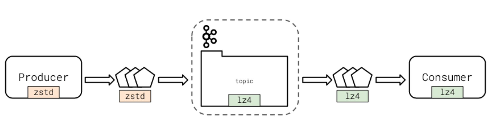

# Kafka Producers

## Synchronous Production

The **synchronous producer** is the simplest type of Kafka producer, it:

- sends data to Kafka
- blocks program execution until the message receipt has been confirmed by the broker
- is useful when you want to ensure data is sent before moving an application forward
- should be used for specific use cases and not as a default producer type

## Asynchronous Production

**Asynchronous production** of Kafka is the most common method of producing data to topics. A few key points to remember about asynchronous producers:

- they send the data and immediately continue
- they are useful when maximizing throughput to Kafka with the least overhead and impact on the integrated application
- they should be the default choice unless the specific use case requires synchronicity

Kafka clients offer callbacks for when messages are delivered or an error occurs so that applications can take rectifying action. Conversely, producers can decide to fire and forget and never check for delivery confirmation or error messages.

## Message Serialization

This process of transforming an application’s internal representation of a data model to a data model suitable for data stores or other applications is called **serialization**.

Kafka itself does not handle the serialization process. Instead, the Kafka client library helps facilitate the process.

Finally, never change the type of serialization in use without recreating the topic. This is a guaranteed way to cause a production outage, as consumers will have no idea what data to expect!

## Producer Configuration

- All available settings for the `confluent_kafka_python` library can [be found in the librdkafka configuration options](https://github.com/edenhill/librdkafka/blob/master/CONFIGURATION.md). `confluent_kafka_python` uses `librdkafka` under the hood and shares the exact configuration options in this document.
- It is a good idea to always set the `client.id` for improved logging, debugging, and resource limiting
- The `retries` setting determines how many times the producer will attempt to send a message before marking it as failed
- If ordering guarantees are important to your application and you’ve also enabled retries, make sure that you set `enable.idempotence` to true
- Producers may choose to compress messages with the `compression.type` setting
  - Options are `none`, `gzip`, `lz4`, `snappy`, and `zstd`
  - Compression is performed by the producer client if enabled
  - If the topic has its own compression setting, it must match the producer setting, otherwise the broker will decompress and recompress the message into its configured format.
  - The `acks` setting determines how many In-Sync Replica (ISR) Brokers need to have successfully received the message from the client before moving on
  - A setting of `-1` or `all` means that all ISRs will have successfully received the message before the producer proceeds
  - Clients may opt to set this to 0 for performance reasons
- The diagram below illustrates how the topic and producer may have different compression settings. However, the setting at the topic level will always be what the consumer sees.

## Message Compression Types - Advantages and Disadvantages

See this [Cloudflare Blog Post](https://blog.cloudflare.com/squeezing-the-firehose/) for an excellent summary of compression type pros and cons.

Here is a quick survey of the compression types and their characteristics:

| Algorithm | Pros                               | Cons                                                   |
| --------- | ---------------------------------- | ------------------------------------------------------ |
| lz4       | fast compression and decompression | not a high compression ratio                           |
| snappy    | fast compression and decompression | not a high compression ratio                           |
| zstd      | high compression ratio             | not as fast as lz4 or snappy                           |
| gzip      | ubiquitous, widely-supported       | cpu-intensive, significantly slower than lz4 or snappy |

## Batching Configuration

When Kafka client libraries send data to Kafka, they do not send every message individually. Instead, the client libraries collect groups of messages together and then send them to the Kafka broker.

- **Batches** – the collection of groups of messages that are sent to a Kafka broker, used to improve application performance

The count, frequency, and quantity of data sent in these batches are customizable.
