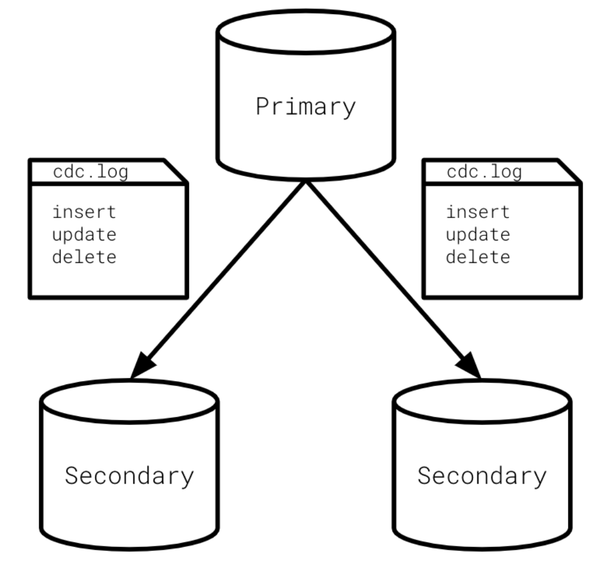

# Append-Only Logs

## Data Streams are Append-Only Logs

- Append-only logs are text files in which incoming events are written to the end of the log as they are received.
- This simple concept -- of only ever appending, or adding, data to the end of a log file -- is what allows stream processing applications to ensure that events are ordered correctly even at high throughput and scale.
- We can take this idea a step farther, and say that in fact, streams are append-only logs.

## Append-Only Logs in SQL Databases

Append-only logs were not originally created for stream processing. Years ago SQL database developers needed a way to track changes and then synch those changes between primary and secondary nodes.

**Change Data Capture (CDC)** – the process of how SQL databases use append-only logs to track, communicate and synchronize changes in the primary database to replica/secondary nodes.

