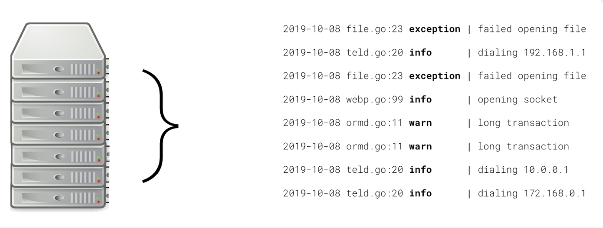
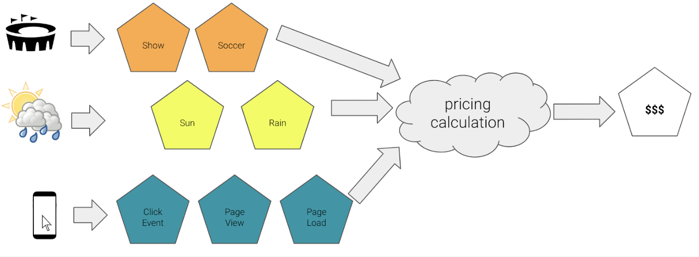

# Stream Processing Examples

## Log Analysis

One of the first places many companies use stream processing is in log analysis. Companies often run microservices that constantly produce logs that are full of information that can be mined for:

- User behavior patterns
- Failure prediction
- Debugging

These logs generate a tremendous amount of data on an ongoing basis, which can be difficult to then analyze. To solve this issue, each log produced by a microservice becomes an event in a data stream.

Companies then build programs that can analyze and join on the events in these data streams to find insights into the data.

## Web Analytics

Modern web applications measure almost every action a user takes on their site, for example:

- Button clicks
- Page load times
- Session duration

The volume of these actions can quickly overwhelm a traditional **data store** (any place you keep data). Ingesting and analyzing this data can be difficult and companies use stream processing to analyze the data as it is generated.

The benefits of this process are:

- It lessens the long-term processing burden for companies because of the smaller dataset
- Provides real-time analysis instead of long-running bath analyses that may only be updated periodically

## Real-Time Pricing

Ride-sharing applications are a great example of data streaming for real-time analysis. They use real-time pricing that adjusts with environmental factors and instantaneous demand.

## Recap

Stream Processing is a critical component in a number of familiar technology applications:

- Finding patterns and meaningful data in disparate log messages in a microservices architecture
- Tracking user engagement in real-time with streaming website analytics
- Real-time pricing in ride-sharing applications based on demand and environmental conditions
- Stock buying/selling based on price, news, and social media sentiment
