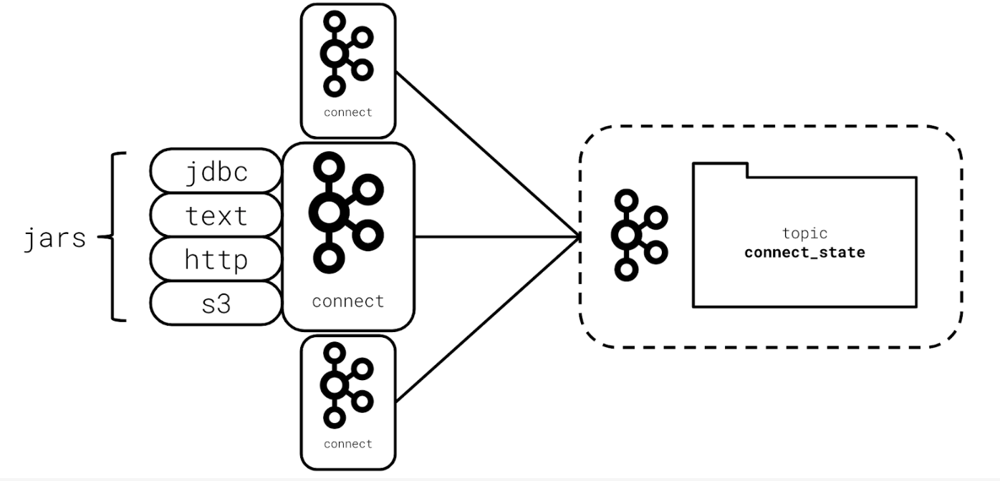

# Kafka Connect

Kafka Connect is a web server and framework for integrating Kafka with external data sources such as SQL databases, log files, and HTTP endpoints.

That team at Confluent recognized that there are many common and repeated scenarios that developers encounter to get data into and out of Kafka. So the team set to work to build a pluggable framework for building reusable Kafka producers and consumers.

The result of their effort was **Kafka Connect**.

Kafka Connect is a framework, written in Java, which:

- allows developers to build an integration once
- then use it repeatedly with just a bit of configuration
- makes it possible to avoid integrating Kafka client code into your applications entirely

## Kafka Connect Architecture

Kafka Connect is an extension of the Kafka project and is built in Scala and Java. Because it is built on the JVM, Kafka Connect can run on most types of hardware and operating systems.

On its own, Kafka Connect is a web server. For Kafka Connect to be able to interact with the outside world, it needs plugins to tell it how to do so.

Kafka Connect plugins:

- implement the actual functionality
- must be implemented against the connect framework API
- are written in a JVM language, like Java

Kafka Connect uses Kafka to store its configuration and track its internal state and it can be run as a single node, or as a cluster.

## The Connect Framework

Kafka Connect plugins are similar to the Kafka consumers and producers you’ve already built!

At a high level, every Kafka Connect plugin defines a few things.

- **Connectors**: which are a high-level abstraction responsible for managing tasks
- **Tasks**: contain the code that specifically manages how data should be produced into or consumed out of Kafka
- **Converters**: which are responsible for defining the mapping between the source or destination system and Kafka Connect and can be used to turn data into Avro or JSON

## Kafka Connect Connectors

There are many types of Kafka Connect plugins available today. Most existing connector plugins are focused on databases and data sources.

Most common connector categories:

- **Local file source and sink** – for moving logs into and out of Kafka
- **Cloud Key Value Store**
- **Traditional SQL databases** such as MySQL or postgres are also common and useful plugins.
- **HDFS data sources**
- **REST APIs**

> **Kafka Connect Connector Plugins**  
> Here are some popular Kafka Connect plugins:
>
> - [Confluent Kafka Connect Plugin Search](https://www.confluent.io/hub/?utm_medium=sem&utm_source=google&utm_campaign=ch.sem_br.brand_tp.prs_tgt.confluent-brand_mt.mbm_rgn.namer_lng.eng_dv.all&utm_term=%2Bconfluent%20%2Bconnect&creative=357969856550&device=c&placement=&gclid=Cj0KCQjwp5_qBRDBARIsANxdcikzhat8UGdi8TVVfxhSATPhQqLibR81tnJC0lVGsPaRubygAORySDEaAhrbEALw_wcB)
> - [Amazon S3 Connector](https://www.confluent.io/hub/confluentinc/kafka-connect-s3)
> - [SQL JDBC Connector](https://www.confluent.io/hub/confluentinc/kafka-connect-jdbc)
> - [HDFS Connector](https://www.confluent.io/hub/confluentinc/kafka-connect-hdfs)
> - [HTTP Connector](https://www.confluent.io/hub/confluentinc/kafka-connect-http)

## The Kafka Connect API

- Your Connector configuration can be Created, Updated, Deleted and Read (CRUD) via a REST API
- You can check the status of a specific Connectors task(s) via the API
- You can start, stop, and restart Connectors via the API
- The choice of a REST API provides a wide-array of integration and management opportunities
- [Official REST API Documentation](https://docs.confluent.io/platform/current/connect/references/restapi.html)

## Kafka Connect Connectors - Optional Further Research

- [Confluent Connector Hub](https://www.confluent.io/hub/?_ga=2.42557541.1345547963.1563205519-78292278.1561645529)
- [List of core Connectors included with most distributions](https://docs.confluent.io/platform/current/connect/kafka_connectors.html)
- [Connect REST API Documentation](https://docs.confluent.io/platform/current/connect/references/restapi.html)

## Kafka Connect Troubleshooting Tips

As demonstrated in the demo video above, if you run into trouble with Kafka Connect in the workspace exercise below, or during your project, here are some tips to help your debugging:

First, use the REST API to check the connector status. `curl http:<connect_url>/connectors/<your_connector>/status` to see what the status of your connector is
Next, use the REST API to check the task status for the connector. `curl http:<connect_url>/connectors/<your_connector>/tasks/<task_id>/status` to see what the status of your task is
If you can’t deduce the failure from these two options, the next best bet is to examine the logs of Kafka Connect. Typically, a tool like `tail` or `less` is useful in examining the logs for Kafka Connect. On Linux systems, Kafka Connect logs are often available in `/var/log/kafka/`. Kafka Connect is often verbose and will indicate what the issue is that it is experiencing.

If you are familiar with Java Management Extensions (JMX) and have access to the server, you may also opt to inspect its JMX metrics for information on failures. However, JMX is most useful for automated monitoring, so you likely will not receive any additional insights from using JMX vs the API or the logs.
