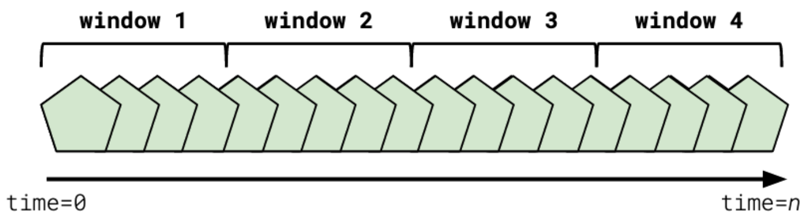
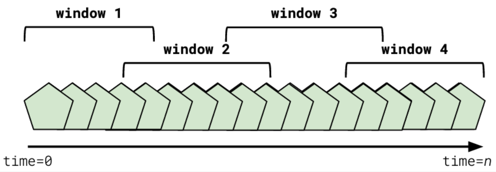
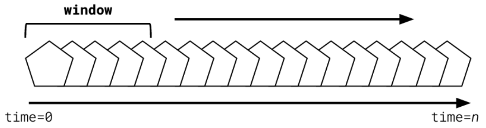

# Stream Processing

## Stream Processing Basics

### Stream Processing Fundamentals

Stream processing applications make use of streaming data stores like Apache Kafka to provide real-time analytics. Developing an understanding of common strategies, calculations, and learning how to handle data based on time will prepare you for building these applications and getting the most out of your data.

## Stream Processing Strategies

Stream processing applications, never stop running.

- How do you JOIN a dataset that is evolving while you’re performing the calculation?
- How do you FILTER a dataset that's changing as your code runs?

Kafka provides us no functionality to help us with these problems out of the box.

This is where stream processing frameworks come into play. In the following sections, we’ll see how we can accomplish this functionality on constantly evolving streams.

## Combining Streams

- **Combining or joining** streams is the action of taking one or more streams and creating a single new output stream.
- Joined streams always share some common attribute across the data in all of the streams. For example, we might use a `user_id` to merge user streams.
- State must be kept as events flow through the join calculation, until all of the related data has arrived. Once this happens, the new event can be emitted, and the state can be flushed
  - If the related data never fully arrives, at some point the data in memory should be cleared
  - This process is typically accomplished through _windowing_, which is covered in a later section of this lesson.

> The critical difference in combining streams scenarios relative to traditional batch processing approaches is that calculations run continually, and not on a specific scheduled basis.

## Filtering Streams

- Filtering a stream is the process of removing unwanted or unneeded data from an input stream, and outputting the desired data into a new stream
- Filtering may be a step in joining or combining two or more streams
- Filtering is often desirable when data clients don’t need access to all data for throughput or security reasons
- Applying filters earlier, rather than later, in the processing pipeline, can allow stream processing calculations to scale better and analyze less data.

A classic example of data filtering is refining a given dataset for a specific audience.

Many streaming data stores house what are referred to as **“raw” streams** – streams in which all data is present. For example, we might work at a marketing firm, and we want to perform some sentiment analysis on our client’s brands.

Given that we want to perform sentiment analysis, we might pipe in raw social data feeds. An example of this might be twitter. Even if we limit the data in the “raw” datafeed to tweets that mention our clients, this will still be quite a bit of data. So we might apply a filter that splits out the raw feed for each one of our clients into their own field. This is a simple example of filtering.

Filtering allows for taking a massive, difficult to understand dataset, and quickly refining it into smaller relevant chunks.

## Remapping Streams

- Remapping streams is the process of transforming an input event and outputting it in a different form to a new stream
- Remapping may be done in conjunction with other processing steps, such as filters or joins
- Remapping is commonly used for data health, application compatibility, and security reasons
- Example Scenario 1: Transforming one data serialization format to another. E.g., Avro -> JSON, or JSON-> Avro
- Example Scenario 2: Removing sensitive or unnecessary fields from an input payload
- Example Scenario 3: Transforming an input event into a format suitable for downstream use by moving data fields or renaming them

> One of the most common use cases of data remapping is filtering out **personally identifiable information, or PII**, from input data streams.

## Aggregating Streams

- An aggregation involves taking two or more distinct events and creating one or more new events based on a transformation function
- Aggregate Functions: Max, Min, Sum, TopN, HIstograms, Sets, Lists, and more
- Aggregates in streaming applications almost always involve a timeframe, unless the source topic is compacted

Aggregation functions provide some of the most exciting insights from our streaming data.

- Let’s pretend we work at a software as a service company together. We’re trying to understand the kinds of problems that our customers have, as well as the types of problems that particular categories have so that we can better improve our product.
- We might have a raw datastream of all pageviews for our support site, broken down by user.
- If we simply counted this data by page, we could see, by timeframe, what our most visited support pages were.

## Handling Time

Understanding time and how it applies to our data is a critical part of building a successful stream processing application. In the following sections we will review the various types of time windowing.

In the previous sections, we learned about the types of processing we might perform on an input data stream in a stream processing application. We also vaguely touched on the notion of time periods, noting that in stream processing, we don't usually look at all of the data in a stream at once.

How we decide the timeframe containing the data that we do look at is a process known as **windowing**.

- A **_window_** in a stream processing application is a period of time, with a start and an end, in which data is gathered for analysis, by key
- Windows can also take place in the past - they don't always have to be relative to the current moment in time
- Windows are the building blocks of the aggregation and join functions that allow us to create interesting stream processing applications

### Tumbling Window

- Tumbling windows represent a fixed period of time that rolls over after that period of time has elapsed - ex: A 15 minute tumbling window started now would include all data from now until the 15th minute. On the 15th minute, the data is cleared and a new 15 minute window is started.
  - Tumbling windows do not overlap
  - Tumbling windows do not have gaps between windowed periods

### Hopping Window

- Hopping windows have both a duration and an increment by which they are advanced
  - ex.- A window of 45 minutes with an increment of 5 minutes would advance every 5 minutes. The oldest 5 minutes of the previous window would be dropped, and the newest 5 minutes of data would be added.
- Hopping windows can overlap with previous windows
- Hopping windows can have gaps if the increment time is larger than the duration period

### Sliding Window

- Similar to Hopping Window, except the increment is not directly configurable and updates in real-time
  - A sliding window of the last 12 hours always includes all of the last 12 hours of data. Data is expired as soon as it reaches the 12-hour threshold, and new data is added as soon as it is received.
- Sliding Windows have no gaps between windows
- Sliding Windows do overlap

