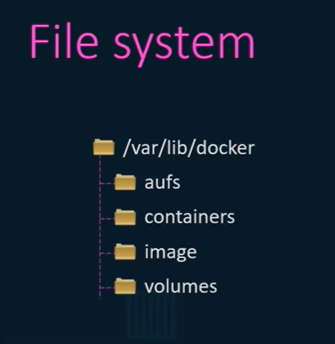
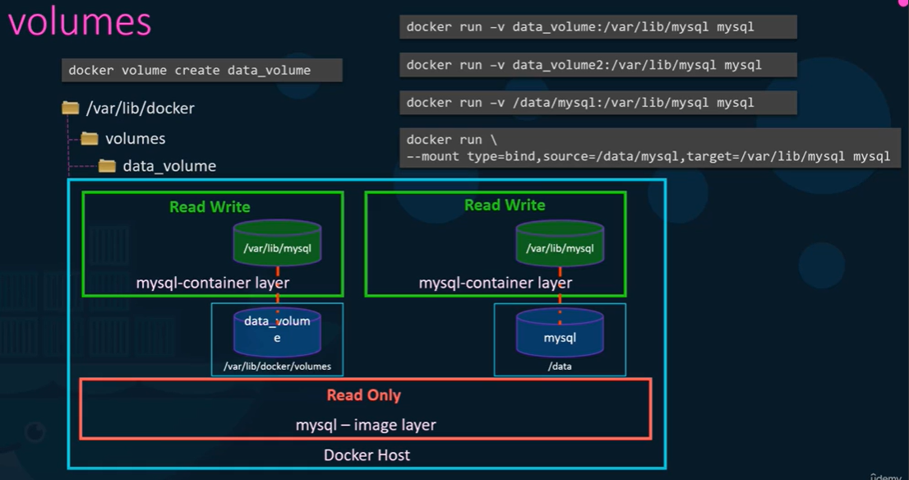

# Docker Storage

## File System

## Volumes

`-v` is the old fashioned way, the new way is `--mount` option.

There are 2 types of mount:
- **Volume mount**: mount a folder in `/var/lib/docker/volumes` (default location for docker volumes)
- **Bind mount**: mount a folder in another directory