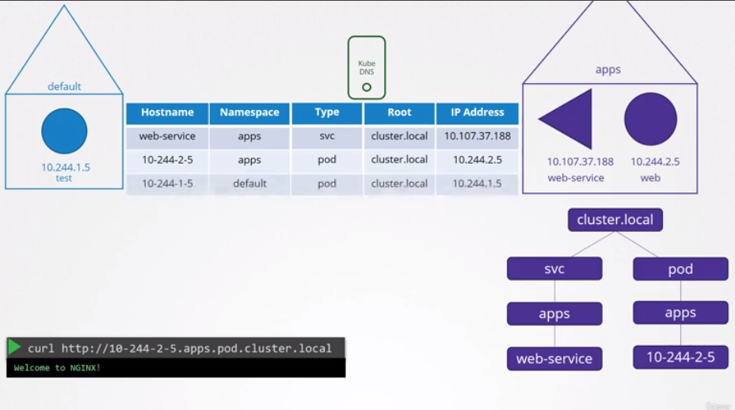

# Service Networking

> When a service for a pod is created, `kube-proxy` create a rule in the route table to route traffic coming to IP of service to its pod. **In fact there aren't any services exist at all.**

## DNS in Kubernetes



## CoreDNS in Kubernetes

```Corefile
.:53 {
    errors
    health
    kubernetes cluster.local in-addr.arpa ip6.arpa {
        pods insecure
        upstream
        fallthrough in-addr.arpa ip6.arpa
    }
    prometheus :9153
    proxy . /etc/resolv.conf
    cache 30
    reload
}
```