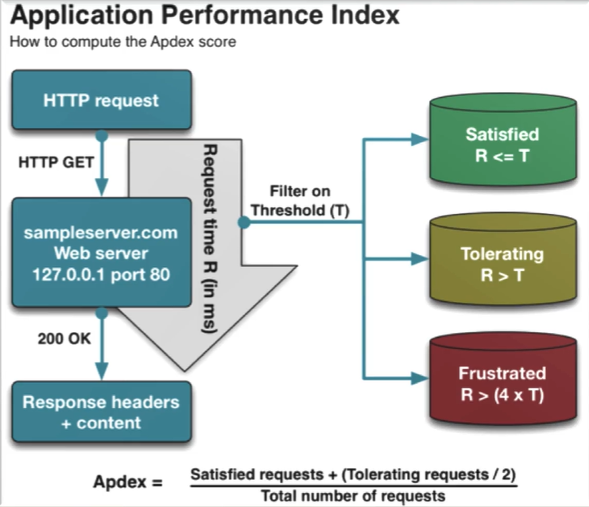

# ApDex

Application Performance Index

- How often users are satisfied with the performance
- How often users are dissatisfied with the performance

> ApDex is between 0 and 1 (`1` is Best, `0` is Worst)

