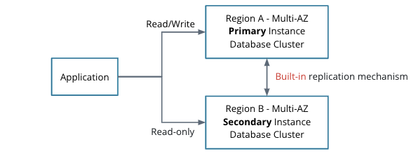
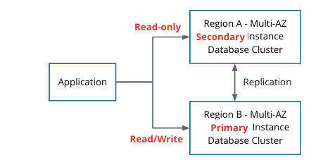

# Geo-Replication for SQL Instances

We've seen log shipping as a recovery mechanism. But like we also saw, log shipping is a manual failover and could take some time to restore. Are there other options? Yes! **Geo-replication**.

Geo-replication uses a _built-in_ replication mechanism of the database software, Here are some of the advantages of geo-replication:

- Continuous data synchronization between regions
- The secondary database can take over during a failure within seconds
- Automatic failover!

During a failover, you can

- Flip the primary and secondary back without much hassle
- Keep the secondary in one zone or the other as long as there aren't any huge business or technical requirements to run in one zone or the other

What are some pros and cons of geo-replication?

### Pros:

- Fast recovery
  - No lag between the primary and secondary database clusters
- Automatic failover
  - The secondary can automatically promote itself
  - The application can point to a DNS entry that can automatically flip
- Seamless recovery

### Cons:

- Costly
  - Requires additional software licensing and hardware
- Setup is complex
  - Requires additional software knowledge
  - Requires additional monitoring
