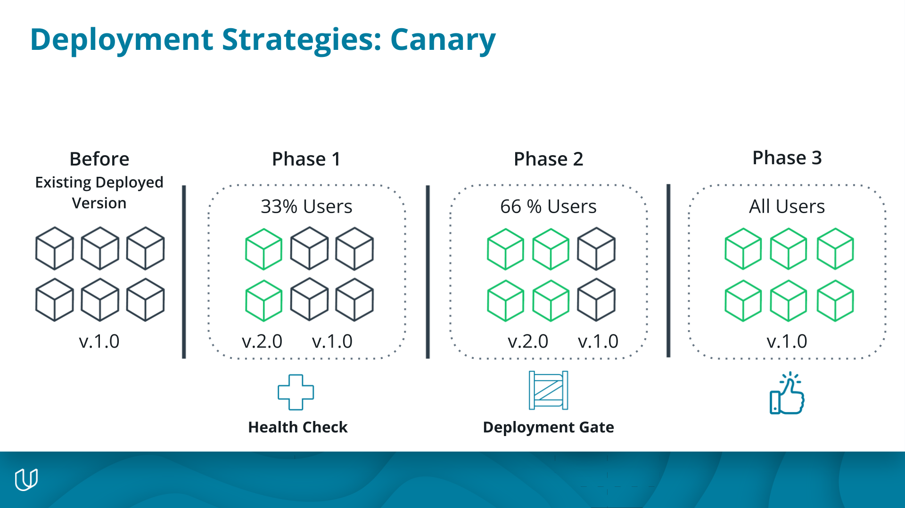

# Canary Deployments

A **Canary deployment** deploys the new version of an application incrementally to a subset of users. This means either 2% of users would access the new version, then 40%, then 60%. The choice is up to the application team. This allows you to test and verify the functionality of the new version in a production environment with real users. You’ll notice this happens often in applications like Twitter, Google products, and Instagram where they may beta test a new feature for feedback before releasing it to all users.

- The deployment rollouts to the environment 33% at a time. It creates enough replicas of version2 to satisfy the 33% rollout strategy and if those replicas pass a health check then it takes down 33% of active version1 replicas to replace.
- The deployment is considered complete even though only 33% of the new version has rolled out. This is when manual verification begins, and if the business decides they want to roll out additional replicas they will manually trigger the next phase of the deployment. These are known as **deployment gates**
- The deployment continues to deploy 33% at a time, confirming health checks, pausing, and waiting for a manual confirmation that it can proceed after testing steps.
- This life cycle is repeated until all v2 replicas have been deployed successfully

The rollback scenario is exactly the same as the rolling deployment

To summarize a Canary deployment:

- It is low risk
- Allows you to beta test new features in production with real users
- Speed of deployment is configurable, you could deploy 4% at a time or decide to deploy 90% in one go.
- Cheaper than Blue-green deployments because it does not require the creation of two duplicate production environments. We’ll get into this in the next lesson.
- Simple to rollback\* (if there is no database involved).

Issues with Canary deployments

- Requires the application to support multiple deployed versions for a long period of time. application feature flags may be necessary.
- Testing new features with real users is a double-edged sword as you are testing brand new content in production where acceptance is unknown and new bugs can arise.
- Deployment automation can be complex to ensure stable deployments are able to pick up successfully where they left off
- Manual verification requires human intervention, and whenever humans are involved in a deployment process there is risk of error.
- This type of deployment works best when you want to beta test a feature on real users and assess feedback, and when you want to add verification gates for completing a deployment

