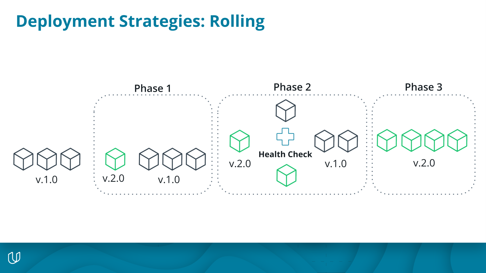

# Rolling Deployments

In a **rolling deployment**, all active services are brought down and incrementally replaced with the new deployment version after passing a health check.

- A **health check** is a periodic REST API call to confirm the status of your microservice.
- The deployment rollouts to the environment one instance at a time. It creates a replica of version2 and if that replica passes its health check then it takes down 1 replica of version1 to replace it.
- It continues to do this 1 at a time, confirming health checks until all version2 replicas have been deployed successfully

In the event of a failure:

- The deployment rollouts to the environment one instance at a time. It creates a replica of version2, and if that replica fails its health check, then the new version is taken down and the deployment is aborted.

In the event of a failure in the middle of a successful rollout:

- The deployment rollouts to the environment and is almost at completion, but raises an error or failed health check on the last replica.
- Roll back to the previous version and allow the application function with the last stable version

Rolling deployments are:

- Simple to rollback\* ( if there is no database involved)
- Not as destructive as basic deployments
- Is an Incremental approach to zero downtime for an organization.
- Are cheap in the sense the automation is easy to implement and for a lot of container frameworks, this is done for you. In the case of Kubernetes, this is the default deployment strategy.

Rolling deployment considerations:

- Requires the application to support multiple deployed versions during deployment.
- Health check verification for every incrementally deployed application may be slow
- Works best in an environment where applications are independent of each other. For e.g in a network of microservices, each implementing a small feature of the application.
- Works best when rolling out small changes to an application that are unlikely to break things.

