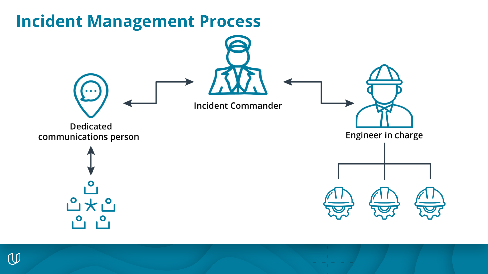

# Incident Management

One of the key things you should be able to do while on-call is to distinguish the difference between an incident and a non-incident.

To identify an incident, you should review the following metrics:

- **SLO/SLAs you have with customers (both internal and external)**
    - SLO/SLAs define your obligations to customers and the metrics for meeting those obligations.
    - Your team should be involved with creating the SLA/SLOs.
- **Actions necessary to correct an issue**
    - If an engineer has to make major changes to the system, it is most likely an incident. A major change includes things like reboots, rollbacks, and configuration changes.
    - These major changes or actions need to be coordinated between different groups.
- **Time spent on correcting the issue**
    - Set a threshold for the max time for which an engineer can troubleshoot an issue before calling for backup.
    - Setting this threshold prevents issues from dragging on or becoming full-blown outages and promotes better on-call balance.
- **Data issues**
    - If there are any issues with data, it should immediately be declared an incident. You should ensure your customers' data is intact and secure.
    - Data issues include loss, corruption, and non-compliance.
        - Data loss: if data does not reach its destination, is not saved to disk, or is deleted by accident.
        - Data non-compliance: examples are data theft or inappropriate access.
- **Visibility**
    - If any external customer can see the effects of an issue, it is an Incident. For example, if customers would notice that a system is down, then it is an incident.

## Incident Management Roles

After you officially have declared an incident, it is time to start the **incident management process**. This process should be well-documented, with clearly defined roles for who does what.

Each team will have its own specific flow for handling an incident; however, you should have some common roles:

- **Incident commander**
    - Notify the incident commander as soon as an incident is declared.
    - The incident commander's responsibilities include:
        - In charge of coordinating tasks and delegating duties.
        - Engage additional resources as necessary.
        - Initiate a central point of communication, i.e., a shared state document.
    - This role should rotate through team members.
- **Communications**
    - There should also be a person dedicated to handling communications. This person
        - Is in charge of tracking the state of the incident.
        - Updates relevant stakeholders on the state of the incident.
- **Engineers**
    - The group is performing operational work.
        - It should be the **only** group doing operation work.
    - Should have one engineer-in-charge coordinating work.

A clear command structure, together with a documented incident management process, allows teams to focus on resolving the incident.

## Documenting an Incident

There are two important pieces of documentation relating to an incident: the shared **live state document** while the incident is ongoing and the **post-mortem**. We will discuss post-mortems later.

It is important to have a live, up-to-date view of an incident. This live state document helps to keep all groups involved updated as well as provides a starting point for additional support.

While the contents and format of the document will vary between teams, it should still cover at least the following components:

- **Stakeholders**
    - Internal team members include:
        - Engineers performing operational work
        - Person handling communications
        - Management
        - The incident commander
    - Track both internal and external customers affected.
- **Timeline**
    - There should be a timeline of actions, communications, and alerts.
    - This timeline makes it easier to track things as they happen and serves as a central location of events to establish cause and effect.
- **Summary**
    - High-level summary for the non-technical groups involved in the incident.
    - Serves to keep executive management up-to-speed and as a basis for customer communications.
    - This summary is also a starting point for additional operational support.
- **Detailed Status Report**
    - Includes the full technical status.
    - Serves to onboard additional operation team support.
    - Centralizes the state of the affected systems.
    - You should review periodically to keep current with the state of the system.
- **Resolution Objectives**
    - Every incident has a set of criteria or objectives to declare the incident resolved.
    - These objectives should align with the SLA (if one exists) or other metrics.
    - The objective should be measurable with a clear goal.
    - The incident is declared resolved when objectives are met.
- **Post-Incident Actions**
    - In this section, you will include what future mitigations that need to be implemented to prevent the incident from happening in the future.
    - This section becomes the basis for the action plan in your post-mortem.
