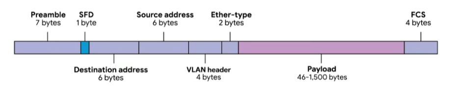

# Dissecting an Ethernet Frame

### **Data packet**

An all-encompassing term that represents any single set of binary data being sent across a network link.

Also known as Ethernet frame at the Ethernet level.

### **Ethernet frame**

A highly structured collection of information presented in a specific order.

Almost all sections of an Ethernet frame are mandatory and most of them have fixed size.

- **Preamble:** 8 bytes (64 bits) long, and can itself be split into 2 sections. The first 7 bytes are a series of alternation 1s and 0s - Buffer between frames and can also be used by the network interfaces to synchronize internal clocks they use to regulate the speed at which they send data.
- **SFD (Start Frame Delimiter):** The last byte in the Preamble - Signals to a receiving device that the preamble is over and that the actual frame contents will now follow.
- **Destination MAC address:** The hardware address of the intended recipient.
- **Source MAC address:** Where the frame originated from.
- **Ether-type field:** 16-bits long and used to describe the protocol of the contents of the frame.
- **VLAN header:** Instead of Ether-type field, you can also find this. Indicates that the frame itself is what's called a VLAN frame. If a VLAN header is present, the EtherType field follows it.
  > `Virtual LAN (VLAN)`  
  > A technique that lets you have multiple logical LANs operating on the same physical equipment.
- **Payload:** In networking terms, is the actual data being transported, which is everything that isn't a header (46 - 1500 bytes long).
- **FCS (Frame Check Sequence):** A 4-byte (or 32-bit) number that represents a checksum value for the entire frame.

  > This `checksum value` is calculated by performing what's known as a cyclical redundancy check against the frame.

  > `Cyclical redundancy check (CRC)`  
  > An important concept for data integrity, and is used all over computing, not just network transmissions.
