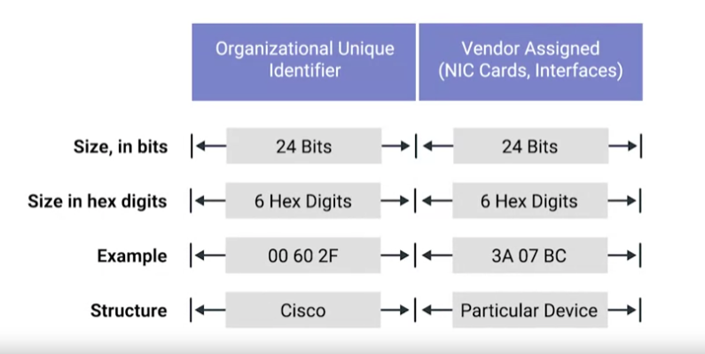

# Ethernet and MAC Addresses

### **Ethernet**

The protocol most widely used to send data across individual links.

Ethernet and the data link layer provide a means for software at higher levels of the stack to send and receive data.  
One of the primary purposes: **Abstract the need for any other layer to care about the physical layer.**

Ethernet as a protocol solve the problem of collision domain by using a technique known as carrier sense multiple access with collision detection (CSMA/CD).

> `CSMA/CD`  
> Used to determine when the communications channels are clear, and when a device is free to transmit data.

### **MAC address**

A globally unique identifier attached to an individual network interface. (MAC -> media access control)  
It is a 48-bit number normally represented by 6 groupings of 2 hexadecimal numbers.

> `Octet`  
> In computer networking, any number that can be represented by 8 bits. 2 hexadecimal digits can represent the same numbers that 8-bits can.

A MAC address is split into 2 sections:

- **Organizationally Unique Identifier (OUI)**: The first 3 octets of a MAC address. These are assigned to individual hardware manufactures by the IEEE (Institute of Electrical and Electronics Engineers).
- The last 3 octets of a MAC address can be assigned in any way possible, with the condition that each possible address only assigned once.

**Ethernet uses MAC addresses to ensure that the data it sends has both addresses of the machine that sent the transmission and the one that will receive it.**
