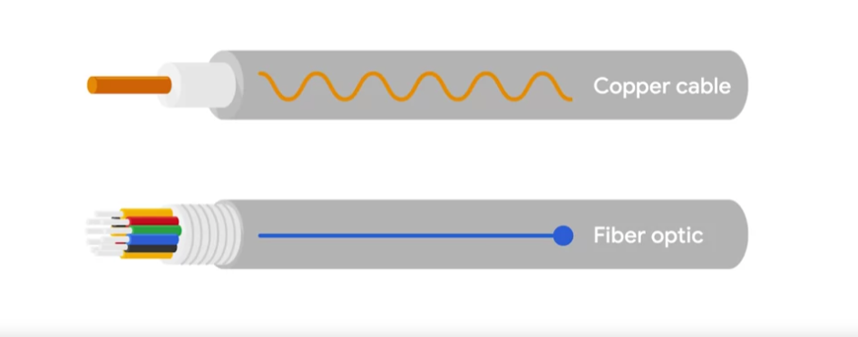

# Cables

Connect different devices to each other, allowing data to be transmitted over them.

Two categories: Copper and Fiber.

## <u>I. Copper</u>

Copper are the most common form of networking cables. (Multiple pairs of copper wires inside plastic insulator)

- The sending device communicates binary data by changing the voltage between 2 ranges.
- The system at the receiving end is able to interpret these changes as binary => Translate into different forms of data.

The most common forms of copper twisted-pair cables used in networking: `Cat5`, `Cat5e`, `Cat6` cables. (Cat -> category). These categories have different physical characteristics (number of twists in a pair of copper wires) => **Different usable lengths and transfer rates**.  
==> How quickly data can be sent, how resistant these signals are to outside interference.

### **Crosstalk**

When an electrical pulse on 1 wire is accidentally detected on another wire. The receiving end isn't able to understand the data cause network error.

Higher level protocols have methods to detect missing data and request for the 2nd time. => Takes more time.

## <u>II. Fiber (fiber optic cables)</u>

Contain individual optical fibers, which are tiny tubes made out of glass about the width of a human hair.

Fiber cables use pulses of light to represent ones and zeros of underlying data.

Fiber cables sometimes used specifically in environments where there's a lot of electromagnetic interference from outside sources. `(This can impact data being sent across copper wires)`

Fiber can generally transport data quicker than copper, but much more expensive and fragile.

Fiber can also transport data over much longer distances than copper without suffering potential data loss.

> `NOTICE`  
> Would likely run into fiber cables in computer data centers than at home or in an office.
