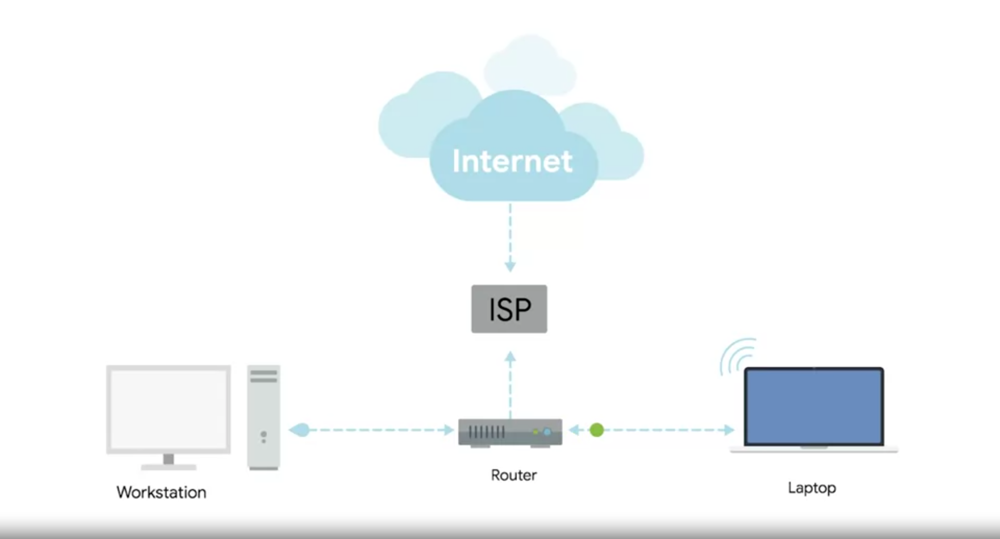

# Routers

A device that knows how to forward data between independent networks (While hubs and switches work primary on a single network - LAN).

`Router operates at Layer-3.` It can inspect IP data to determine where to send things.

Routers store internal tables containing information about how to route traffic between lots of different networks all over the world.

> **ISP:** Internet Service Provider

At ISP, a way more sophisticated type of router takes over. These core routers form the backbone of internet and are directly responsible for how we send and receive data over internet. It usually has many different connections to many other routers.

### **Border Gateway Protocol (BGP)**

Routers share data with each other via this protocol, which lets them learn about the most optimal paths to forward traffic.
