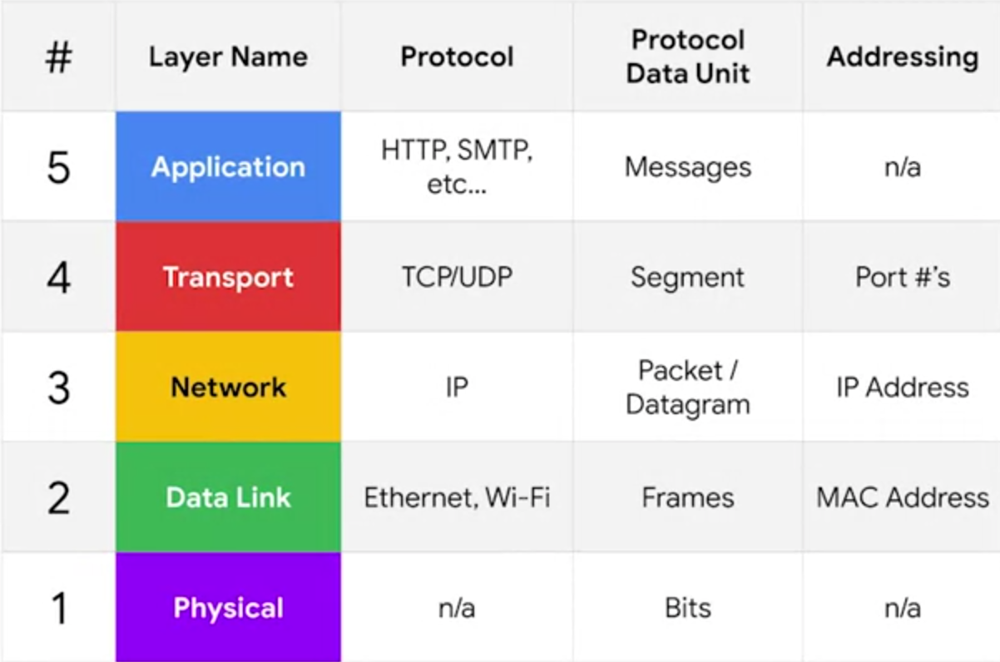
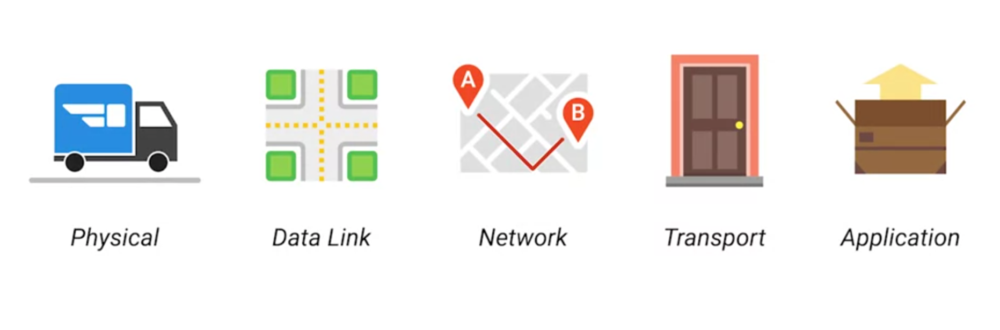

# The TCP/IP Five-Layer Network Model

**1. Physical Layer:** Represents the physical devices that interconnect computers. (cabling, connectors, etc.)

**2. Data Link Layer:**  

- Responsible for defining a common way of interpreting these signals so network devices can communicate.

- Lots of `protocols (set of rules in communicate)` exist at this layer, but the most common is known as Ethernet.

- The `Ethernet` standards also define a protocol responsible for getting data to nodes on the same network or link.

**3. Network Layer (Internet Layer):**  

- Allows different networks to communicate with each other through devices known as routers.

- `Internetwork:` A collection of networks connected together through routers, the most famous of these being the internet.

- The most common protocol: `IP (internet protocol)` - the heart of the internet and most smaller networks around the world.

- Responsible for getting data from one node to another.

**4. Transport Layer:**  

- Sorts out which client and server programs are supposed to get that data.

- The most common protocol: `TCP (tranmission control protocol)`.

- Responsible for ensuring that data gets to the right applications running on those nodes.

**5. Application Layer:**

