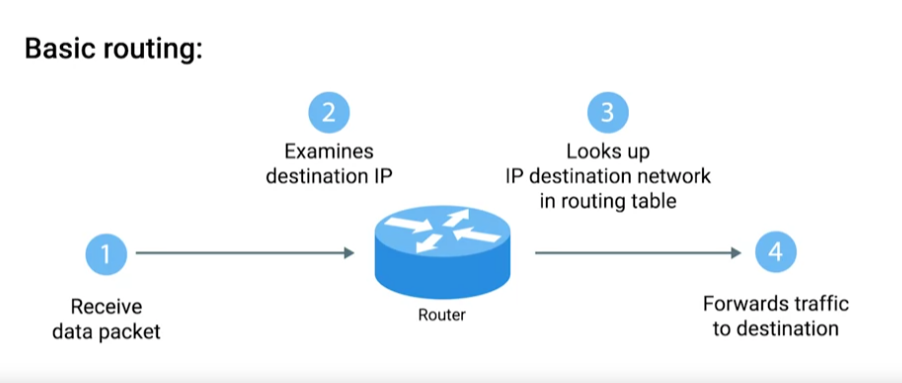

# Basic Routing Concepts

### **Router**

A network device that forwards traffic depending on the destination address of that traffic. A router has at least 2 network interfaces since it has to connect to 2 networks to do its job.

> In order to protect against breakages, core internet routers are typically connected in a mesh, meaning that there might be many different paths for a packet to take.
