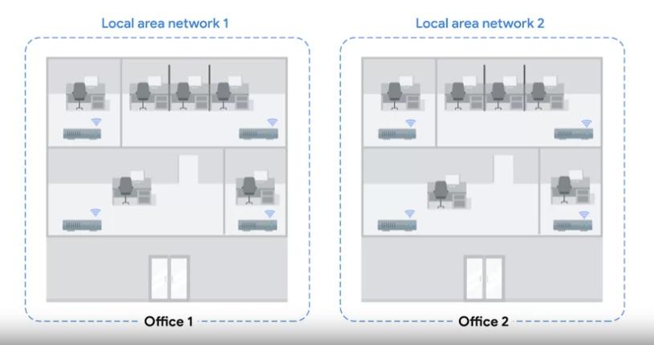
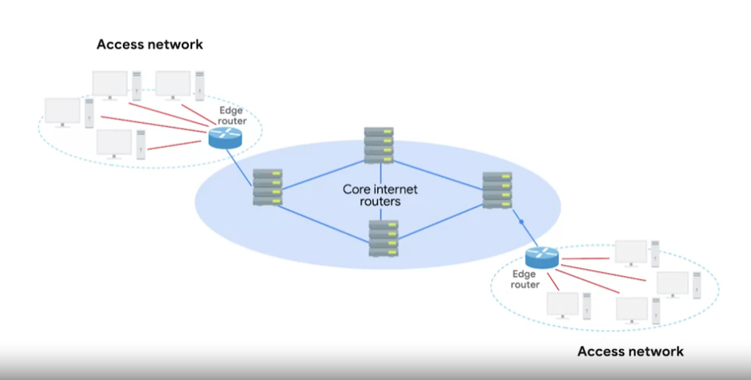

# Routing Protocols

These are special protocols the routers use to speak to each other in order to share what information they might have.

2 main categories: `interior gateway protocols` and `exterior gateway protocols`.

`Interior gateway protocols` are further split into 2 categories: `link state routing protocols` and `distance-vector protocols`.

## <u>I. Interior Gateway Protocols</u>

Used by routers to share information within a single autonomous system.

### **Autonomous system**

A collection of networks that all fall under the control of a single network operator.

The best example of this would be a large corporation that needs to route data between their many offices and each of which might have their own local area network.

### **Distance-vector Protocols**

An older standard.  
A router using this basically just takes its routing table, send it to every neighboring router which is basically every router directly connected to it.

> In computer science, a `list` is known as a `vector`.

With this protocol, routers don't really know that much about the total state of an autonomous system, only some information about their immediate neighbors.  
=> **A router might be slow to react to a change in the network far away from it.**

### **Link State Routing Protocols**

With this protocol, every router on the system knows every detail about every other router in the system. Each router then runs complicated algorithms againts these large information to determine the best path.  
=> Require more memory to hold all these data and much more processing power.

## <u>II. Exterior Gateway Protocols</u>

Are used for the exchange of information between independent autonomous system.

> Since autonomous systems are known and defined collections of networks, getting data to the edge router of an autonomous system is the number 1 goal of core Internet routers.

### **Internet Assigned Numbers Authority (IANA)**

A non-profit organization that helps manage things like IP address allocation.

> Along with managing IP address allocation, the `IANA` is also responsible for `ASN (Autonomous System Number)` allocation.

### **Autonomous System Number (ASN)**

Numbers assigned to individual autonomous systems.

32 bits number just like IP address, but is referred to as single decimal number instead of being split out into readable bits. Reasons:

- IP addresses need to be able to represent a network ID portion and a host ID portion for each number. This is more easily accomplished by splitting the number in four sections of eight bits, especially back in the day when address classes ruled the world. An ASN never needs to change in order for it to represent more networks or hosts, it's just the core Internet routing tables that need to be updated to know what the ASN represents.
- ASNs are looked at by humans far less often than IP addresses are. So, because it can be useful to be able to look at the IP 9.100.100.100 and know that 9.0.0.0/8 address space is owned by IBM, ASNs represent entire autonomous systems. Just being able to look up the fact that AS19604 belongs to IBM is enough.
