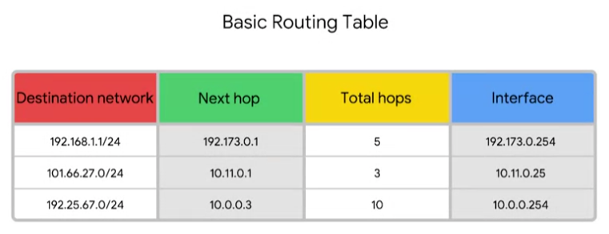

# Routing Tables

### **Destination network**

This column would contain a row for each network that the router knows about.

### **Next hop**

This is the IP address of the next router that should receive the data intended for the destination networking question.

### **Total hops**

For each next hop and each destination network, the router has to keep track of how far away that destination currently is. That way, when it receives updated information from neighboring routers, it will know if it currently knows about the best path, or if they knew better path is available.

### **Interface**

The router also has to know which of its interfaces it should forward traffic, matching the destination network out of.
