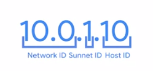
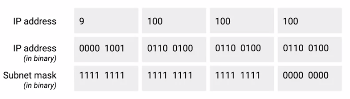
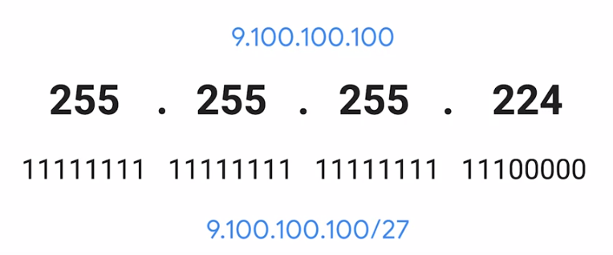
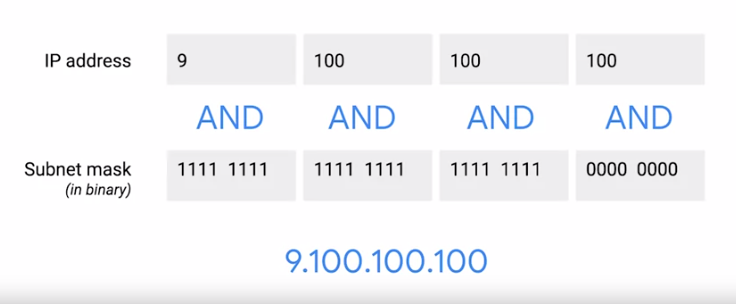

# Subnet Masks

In a world with subnetting, some bits of host ID are actually used for the subnet ID.

Core routers use network ID to send datagram along to gateway routers. Gateway routers have additional info to use to send datagram along to the destination machine or next router in the path. Host ID is used by last router to deliver datagram to recipient machine.

Subnet IDs is calculated via Subnet masks.

### **Subnet masks**

32-bit numbers that are normally written out as 4 octets in decimal.

A subnet mask is a binary number that has 2 sections: 
- The beginning part, which is the mask itself, is a string of 1s.
- The second part is just 0s.

The part with all the 1s tell us what we can ignore when computing a host ID. The part with all 0s tell us what to keep.

In general, a subnet can usually only contain two less than the total number of host IDs available. (0 is generally not used, 255 is reserved as broadcast address). Still, generally speaking, you'll refer to the number of hosts available in a subnet as the entire number.

> A subnet mask is a way for a computer to use `AND` operators to determine if an IP address exists on the same network.

