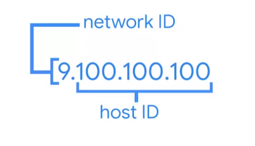
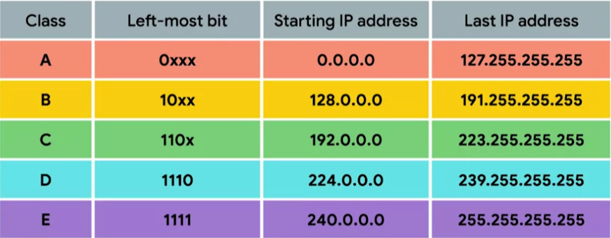

# IPv4 Address Classes

IP addresses can be split into 2 sections: `network ID` and `host ID`.

### **Address class system**

A way of defining how the global IP address space is split up.

- **Class A:** first octet used for network ID, last 3 used for host ID.
- **Class B:** first 2 octet used for network ID, last 2 used for host ID.
- **Class C:** first 3 octet used for network ID, last octet used for host ID.

**CIDR (Classless Inter-Domain Routing) has mostly replace this class system.**
