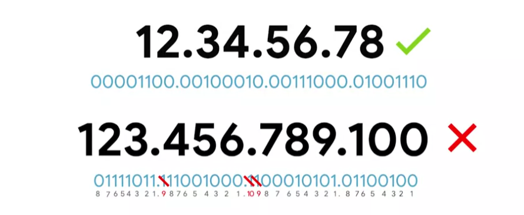

# IPv4 Addresses

IP addresses are a 32-bit long numbers made up of 4 octets, each octet is normally described in decimal numbers.

**Dotted Decimal Notation**

> IP addresses belong to the networks, not to the devices attached to those networks.

> On many modern networks, you can connect a new device and an IP address will be assigned automatically through a technology called Dynamic Host Configuration Protocol - `Dynamic IP address`. The opposite of it is called a `Static IP address` which must be configured on a node manually.

> In most cases, static IP addresses are for servers and network devices, while dynamic IP addresses are for clients.
