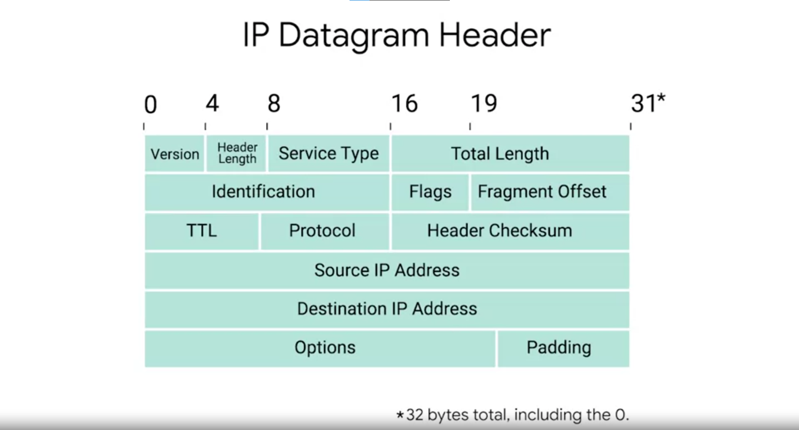
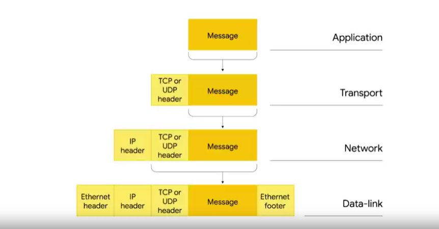

# IPv4 Datagram and Encapsulation

IP Datagram is a packet under the IP protocol. It is a highly structured series of fields that are strictly defined.

The 2 primary sections of an IP datagram are the `header` and the `payload`.

### IP Datagram header

- **Version:** The first 4 bits, indicates what version of IP is being used `(The most common is IPv4)`.
- **Header Length:** Also 4 bits, declares how long the entire header is `(Almost always 20 bytes, minimum length of header, in length with IPv4)`.
- **Service Type:** 8 bits, can be used to specify details about quality of service (QoS) technologies. About QoS, there are services that allow routers to decide which IP datagram maybe more important.
- **Total Length:** The rest 16 bits field, indicate the total length of the IP datagram it's attached to.
- **Identification:** A 16 bits number that's used to group messages together.

> The maximum size of a single datagram is the largest number you can present with 16 bits: `65535`. If the total amount of data need to be sent is greater, the IP layer will split this data up into many individual packets. Then the identification field is used so that receiver knows that every packet with the same value in that field is part of the same transmission.

- **Flag:** Used to indicate if a datagram is allowed to be fragmented, or to indicate that the datagram has already been fragmented.
- **Fragmentation:** The process of taking a single IP datagram and splitting it up into several smaller datagrams.

> In cases when data is moving from a network allowing larger datagram size to a smaller one, the datagram would have to be fragmented into smaller ones. The fragmentation offset field contains value used by receiver to take all the parts of a fragmented packet, sort it in the right order and restore the initial datagram.

- **TTL:** An 8 bits field that indicates how many router hops a datagram can traverse before it's thrown away. `(To make sure that when there's a misconfiguration in routing that causes an endless loop, datagrams don't spend eternity trying to reach destination)`
- **Protocol:** Another 8 bits field that contains data about what transport layer protocol is being used.
- **Header Checksum:** A checksum of the contents of the entire IP datagram header. `(This changes at each router as the TTL gets decreased at each router)`

- **IP options field:** An optional field and is used to set special characteristics for datagrams primarily used for testing purposes. `(Optional and variable in length)`
- **Padding:** A following field after IP options field. A series of 0s used to ensure the header is the correct total size

