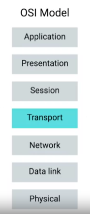

# The Application Layer and the OSI Model

Allows applications to communicate in a way they understand.

## **OSI Model**

### **Session Layer**

Responsible for facilitating the communication between actual applications and the transport layer.

Takes application layer data and hands it off to the presentation layer.

### **Presentation Layer**

Responsible for making sure that the unencapsulated application layer data is able to be understood by the application in question. `(Handle encryption or compression of data)`
