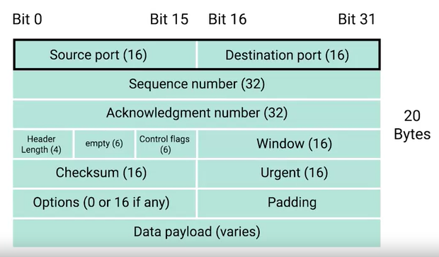
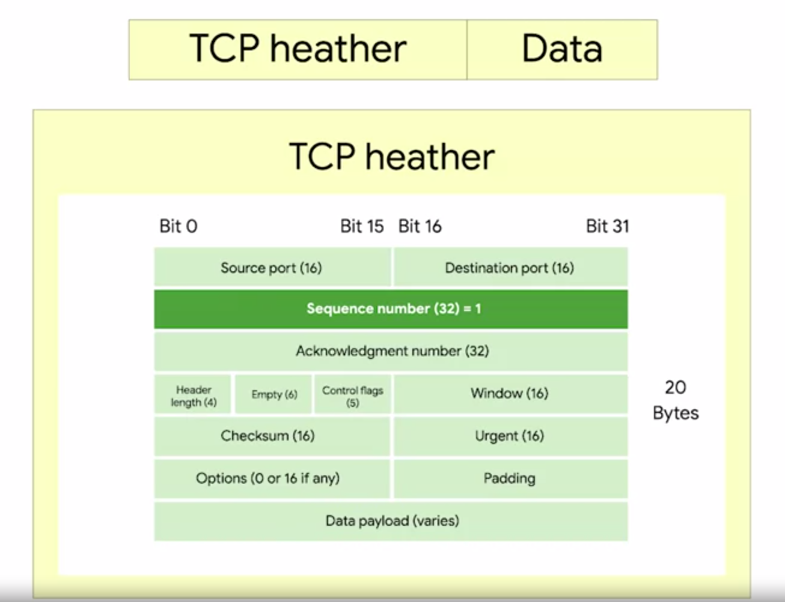
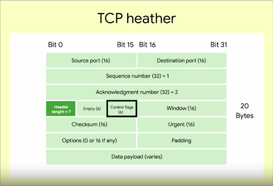

# Dissection of a TCP Segment

### **TCP Segment**

Made up of a TCP header and a data section.

- **Source port:** A high-numbered port chosen from a special section of ports known as ephemeral ports. Required to keep lots of outgoing connections separate.
- **Destination port:** The port of the service the traffic is intended for.
- **Sequence number:**
    - A 32-bit number that's used to keep track of where in a sequence of TCP segments this one is expected to be.
    - TCP split its data into many segments, this sequence number in the header is used to keep track of which segment this might be.
    
- **Acknowledgment number:** The number of the next expected segment.
- **Data offset:** A 4-bit number that communicates how long the TCP header for this segment is. This is for the receiving network device understands where the actual data payload begins.
- **Control flags:** A reserved 6 bits.
    
- **TCP Window:** Specifies the range of sequence numbers that might be sent before an acknowledgement is required.
- **Checksum:** A 16-bit number operate just like the one in IP and Ethernet level.
- **Urgent pointer field:** Used in conjunction with one of the TCP control flags to point out particular segments that might be more important than others.
- **Options:** Like urgent pointer field, this is rarely used in real world. Sometimes used for more complicated flow control protocols.
- **Padding:** Sequence of zeros to ensure that the data payload section begins at the expected location.
