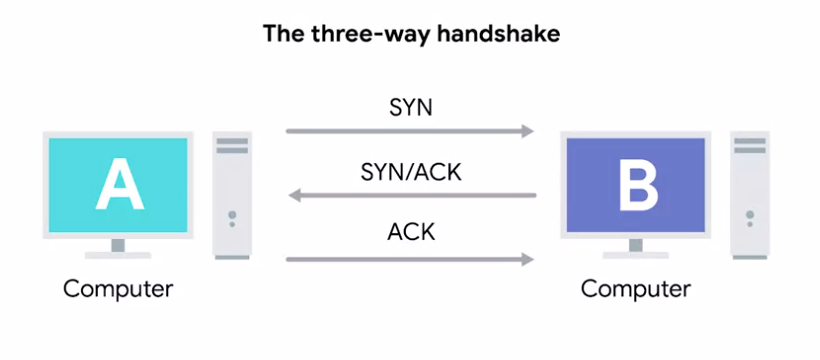
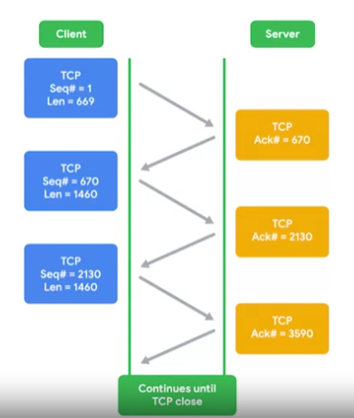

# TCP Control Flags and the Three-way Handshake

## <u>I. TCP Control Flags</u>

### **URG (urgent)**

A value of `1` here indicates that the segment is considered urgent and that the urgent pointer field has more data about this. (Isn't normally seen)

### **ACK (acknowledged)**

A value of `1` in this field means that the acknowledgement number field should be examined.

### **PSH (push)**

The transmitting device wants the receiving device to push currently-buffered data to the application on the receiving end ASAP.

> `Buffer`  
> A computing technique where a certain amount of data is held somewhere before being sent somewhere else.

Lots of practical applications:

- Used to send large chunks of data more efficently. By keeping some amount of data in a buffer, TCP can deliver more meaningful chunks of data for the program waiting for it. But in some cases you might be sending a very small amount of information that you need the listening program to respond to immediately. This is what the push flag does.

### **RST (reset)**

One of the sides in a TCP connection hasn't been able to properly recover from a series of missing or malformed segments.

### **SYN (synchronize)**

It's used when first establishing a TCP connection and makes sure the receiving end knows to examine the sequence number field.

### **FIN (finish)**

When this flag is set to `1`, it means the transmitting computer doesn't have any more data to send and the connection can be closed.

## <u>II. The Three-way Handshake</u>

- A establish TCP connection with `SYN` flag to announce B to create connection and look for A's sequence number field.
- B response with a TCP segment with both `SYN` and `ACK` saying: let's establish a connection and I acknowledge your sequence number.
- A then response with only `ACK` saying: I acknowledge your acknowledgement.

### **Handshake**

A way for 2 devices to ensure that they're speaking the same protocol and will be able to understand each other.

> Each segment sent in either direction should be responded to by a TCP segment with the ACK field sent. This way the other side always knows what has been received.

### **Four-way Handshake (for when the devices are ready to close the connection)**

