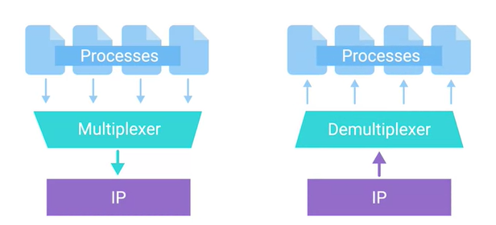

# The Transport Layer

Allows traffic to be directed to specific network applications.

The transport layer has the ability to multiplex and demultiplex, which sets this layer apart from all others.

- **Multiplexing:** The ability to direct traffic toward many different receiving services.
- **Demultiplexing:** The same concept as Multiplexing but just at the receiving end.

Multiplexing and Demultiplexing is handled through ports.

### **Port**

A 16-bit number that's used to direct traffic to specific services running on a networked computer.

> Ex. 10.1.0.10:80 is also known as a `socket address` or `socket number`.

### **FTP (File Transfer Protocol)**

An older method used for transferring files from 1 computer to another, but still in use today.

Traditionally listen on port 21.