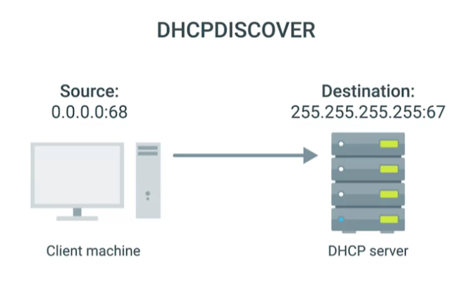
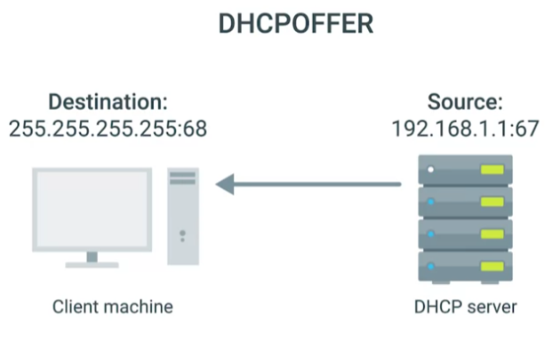
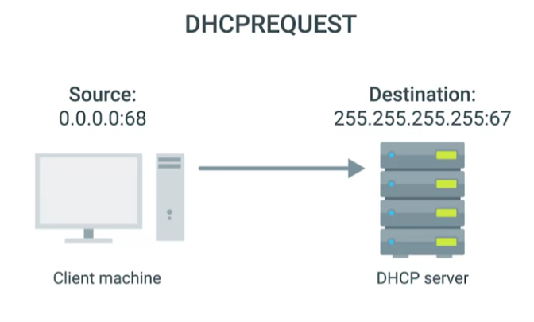
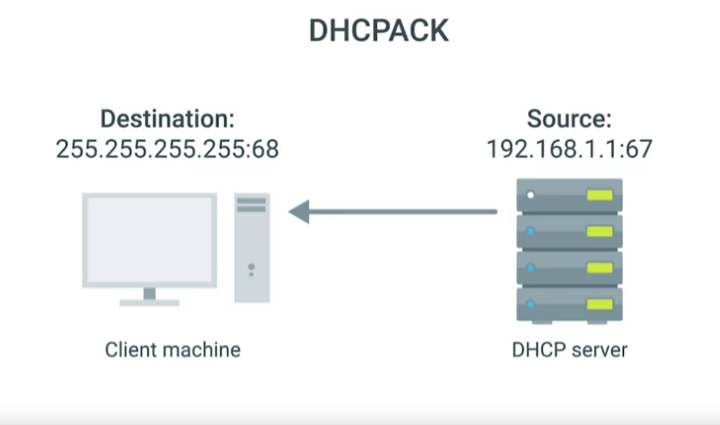

# DHCP in action

### **DHCP discovery**

The process by which a client configured to use DHCP attempts to get network configuration information.

- Client send a specially crafted broadcast message from port 68 to port 67, encapsulated inside an IP datagram with destination IP 255.255.255.255 and source IP 0.0.0.0.
- This broadcast message would get delivered to every node on the local area network, and if a DHCP server is present, it would receive this message.
- Next, the DHCP server would examine its own configuration and would make a decision on what, if any, IP address to offer to the client.

- DHCP response with an offer message from <its-actual-IP>:67 to 255.255.255.255:68 (which is also a broadcast message). The original client would recognize that this message was intended for itself because the DHCP offer has the field that specifies the MAC address of the client that sent the DHCP discover message.
- The client will process this offer to see the offered IP and technically it can reject it since there can be multiple DHCP server within the same network and client can configure to only accept offered IP of a certain range `(This is rare)`.

- Often, the client will responses to the offer that it will take this IP.

- Finally, DHCP server receives the request and broadcast response with a DHCP Acknowledgement message.
- The client recognize this broadcast message and take the IP address. The networking stack on the client computer can now use the configuration information presented to it by the DHCP server to set up its own network layer configuration.

All of this configuration is known as DHCP lease, as it includes an expiration time. A DHCP lease might last for days or only for a short amount of time. Once a lease has expired, the DHCP client would need to negotiate a new lease by performing the entire DHCP discovery process all over again.

A client can also release its lease when it disconnects, so that DHCP can retrieve the IP to its pool.
