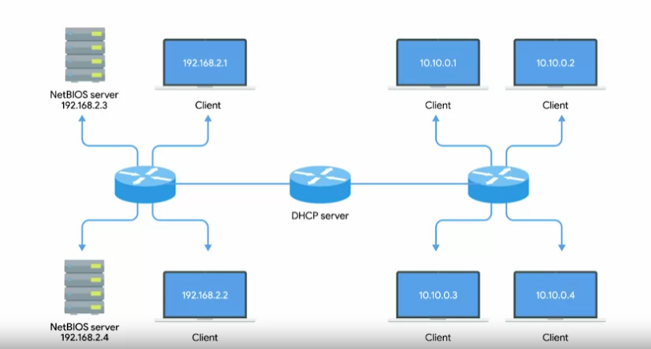

# Overview of DHCP

> `Dynamic Host Configuration Protocol (DHCP)`  
> An application layer protocol that automates the configuration process of hosts on a network.

With DHCP, a machine can query a DHCP server when the computer connects to the network and receive all the networking configuration in one go. Not only does DHCP reduce the administrative overhead of having to configure lots of network devices on a single network, it also helps address the problem of having to choose what IP to assign to what machine.

For servers or network equipment on your network, like your gateway router, a static and known IP address is pretty important. For example, the devices on a network need to know the IP of their gateway at all times.

For a bunch of client devices, like desktops or laptops, or even mobile phones, it's really only important that they have an IP on the right network.

**Using DHCP, you can configure a range of IP addresses that's set aside for these client devices. This ensures that any of these devices can obtain an IP address when they need one. But solves the problem of having to maintain a list of every node on the network and its corresponding IP.**

### **Dynamic allocation**

Most common way DHCP operate. A range of IP addresses is set aside for client devices and one of these IPs is issued to these devices when they request one.

The IP of a computer will be different everytime.

### **Automatic allocation**

A range of IP addresses is set aside for assignment purposes.

DHCP server is asked to keep track of which IPs it's assigned to certain devices in the past so that it can assign the same IP to the same machine each time if possible.

### **Fixed allocation**

Requires a manually specified list of MAC address and their corresponding IPs.

When a computer requests an IP, the DHCP server looks for its MAC address in a table and assigns the IP that corresponds to that MAC address. If the MAC address isn't found, the DHCP server might fall back to automatic or dynamic allocation, or it might refuse to assign an IP altogether.  
=> **Security measure to ensure that only devices that have had their MAC address specifically configured at the DHCP server will ever be able to obtain an IP and communicate on the network.**

Along with things like IP address and primary gateway, you can also use DHCP to assign things like NTP servers.

> `Network time protocol (NTP)`  
> Used to keep all computers on a network synchronized in time.
