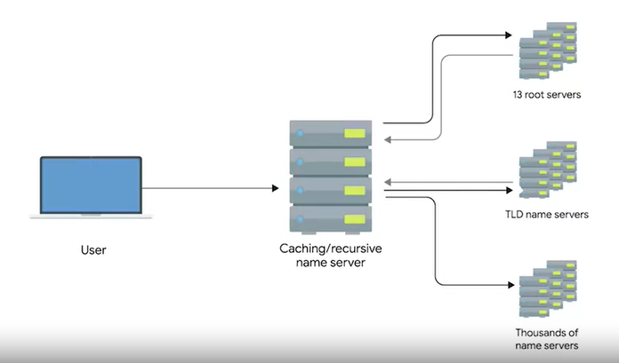

# The Many Steps of Name Resolution

## <u>I. Name resolution</u>

Process of using DNS to turn a domain name into an IP address.

DNS servers are one of the things that need to be specifically configured at a node on a network.

> `Standard modern network configuration`  

    - IP address  
    - Subnet mask  
    - Gateway for a host  
    - DNS server

## <u>II. Five primary types of DNS servers</u>

1. Caching name servers
2. Recursive name servers
3. Root name servers
4. TLD name servers
5. Authoritative name servers

### **Caching and recursive name servers**

Generally provided by an ISP or your local network.

Purpose is to store domain name lookups for a certain amount of time.

**Most caching name servers are also recursive name servers.**

> `Recursive name servers`  
> Performs full DNS resolution requests.

In most cases, your local name server will perform the duties of both, but it's definitely possible for a name server to be either just caching or just recursive.

> All domain names in the global DNS system have a TTL (time to live). This is a value, in seconds that can be configured by the owner of a domain name for how long a name server is allowed to cache an entry before it should discard it and perform a full resolution again.

The first step is always to contact a root name server **(port 53 default)**. There are 13 total root name servers and they're responsible for directing queries toward the appropriate TLD name server. In the past, these 13 root servers were distributed to very specific geographic regions, but today they're mostly distributed across the globe via Anycast. **Anycast is a technique that's used to route traffic to different destinations depending on factors like location, congestion or link health.** Using Anycast, a computer can send a datagram to a specific IP, but could see it routed to one of many different actual destinations depending on a few factors. This should also make it clear that there aren't really only 13 physical root name servers anymore. It's better to think of them as 13 authorities that provide root name lookups as a service. The root servers will respond to a DNS lookup with the TLD name server that should be queried. `TLD stands for top-level domain` and represents the top of the hierarchical DNS name resolution system. A TLD is the last part of any domain name using www.facebook.com as an example again, the.com portion should be thought of as the TLD. For each TLD in existence, there is a TLD name server. But just like with root servers, this doesn't mean there's only physically one server in question. It's most likely a global distribution of Anycast accessible servers responsible for each TLD. The TLD name servers will respond again with a redirect, this time informing the computer performing the name lookup with what authoritative name server to contact. Authoritative name servers are responsible for the last two parts of any domain name, which is the resolution at which a single organization may be responsible for DNS lookups. Using www.weather.com as an example, the TLD name server will point a lookup at the authoritative server for weather.com, which would likely be controlled by the weather channel, the organization itself that runs the site. Finally, the DNS lookup could be redirected at the authoritative server for weather.com, which would finally provide the actual IP of the server in question.
