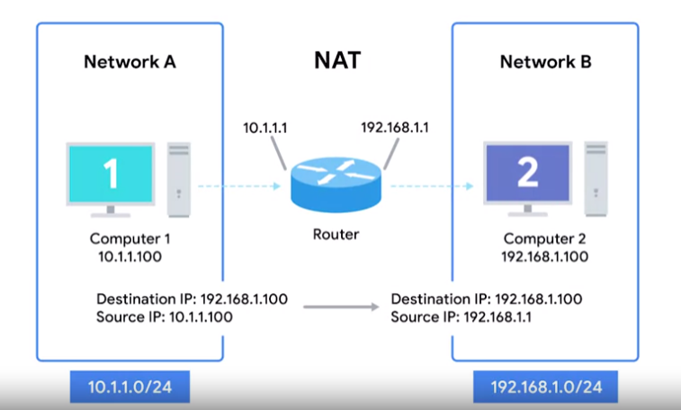

# Basics of NAT

Network Address Translation does pretty much what it sounds like. It takes one IP address and translates it into another.

Reasons: security safeguards, preserving the limited amount of available IPv4 space.

> `Network Address Translation (NAT)`  
> A technology that allows a gateway, usually a router or firewall, to rewrite the source IP of an outgoing IP datagram while retaining the original IP in order to rewrite it into the response.

With NAT, the router will also rewrite the source IP address, which in this instance becomes the router's IP on Network B or 192.168.1.1. When the datagram gets to Computer 2, it will look like it originated from the router, not from Computer 1.

What NAT is doing in this example is hiding the IP of Computer 1 from Computer 2. This is known as `IP masquerading`.

> `IP masquerading` is an important security concept. The most basic concept at play here is that no one can establish a connection to your computer if they don't know what IP address it has.

**We could actually have hundreds of computers on Network A, all of their IPs being translated by the router to its own. To the outside world, the entire address space of Network A is protected and invisible. This is known as `one-to-many NAT`**
