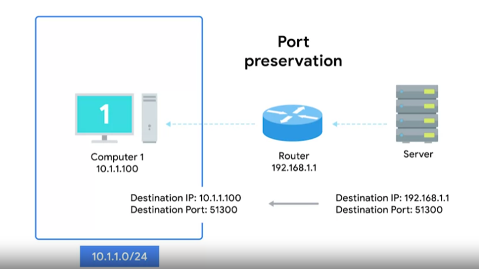
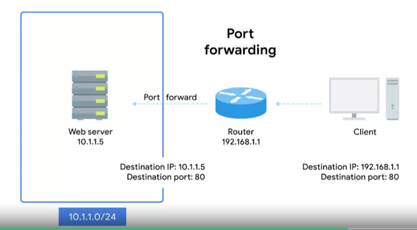

# NAT and the Transport Layer

For the return traffic, it gets more complicated. We now have potentially hundreds of responses all directed at the same IP and the router at this IP needs to figure out which responses go to which computer.

### **Port preservation**

A technique where the source port chosen by a client is the same port used by the router.

The IP is mapped to its port and stored internal inside a table at DHCP server.

If 2 clients choose the same port at the same time, router will select an unused port at random to use instead.

### **Port forwarding**

A technique where specific destination ports can be configured to always be delivered to specific nodes.

This technique allows for complete IP masquerading while still having services that can respond to incoming traffic.

