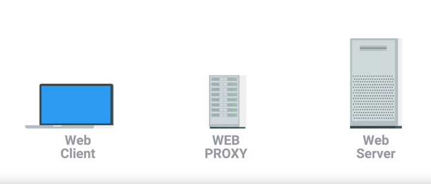
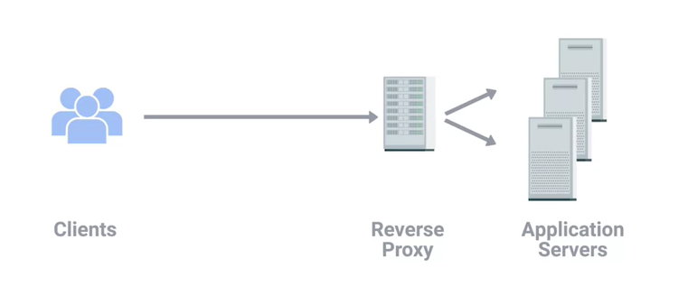
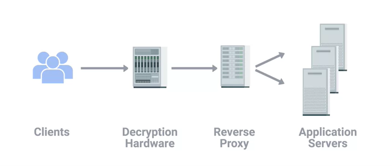

# Proxy services

A server that acts on behalf of a client in order to access another service.

Proxy seats between a client and server, providing some additional benefits:
- Anonymity
- Security
- Content filtering
- Increased performance

### **Web Proxy**

Used to cache web page so that with future requests, it doesn't have to request a fresh page.

However, it is not used commonly today since the connection now is fast enough and also the web is more dynamic nowadays.

A more common use of a web proxy today might be to prevent someone from accessing sites.

### **Reverse Proxy**

A service that might appear to be a single server to external clients, but actually represents many servers living behind it.

A reverse proxy in this situation could act as a single front end for many web servers living behind it.

This is similar to DNS load balancing.

Reverse proxies are now implemented in order to use hardware built specifically for cryptography to perform the encryption and decryption work so that the web servers are free to just serve content.
