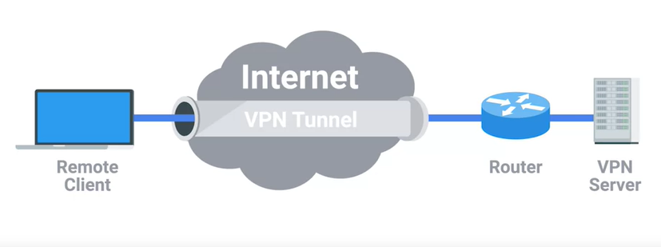

# Virtual Private Networks

A technology that allows for the extension of a private or local network to hosts that might not work on that same local network.

VPNs are a tunneling protocol, which means they provision access to something not locally available. When establishing a VPN connection, you might also say that a VPN tunnel has been established.

- Most VPNs work by using the payload section of the transport layer to carry an encrypted payload that actually contains an entire second set of packets, the network, the transport, and the application layers of a packet intended to traverse the remote network.
- Basically, this payload is carried to the VPN's endpoint where all the other layers are stripped away and discarded. Then the payload is unencrypted, leaving the VPN server with the top three layers of a new packet. This gets encapsulated with the proper data link layer information and sent out across the network.
- This process is completed in the inverse in the opposite direction.
