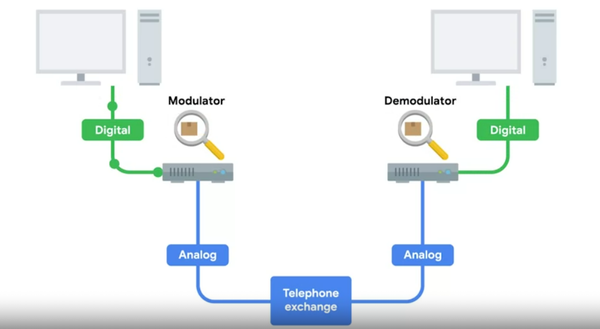

# Dial-up and Modems

A dial-up connection uses POTS for data transfer, and gets its name because the connection is established by actually dialing a phone number.

> The Public Switched Telephone Network, or PSTN, is also sometimes referred to as the Plain Old Telephone Service or POTS.

## **Baud rate**

A measurement of how many bits can be passed across a phone line in a second.