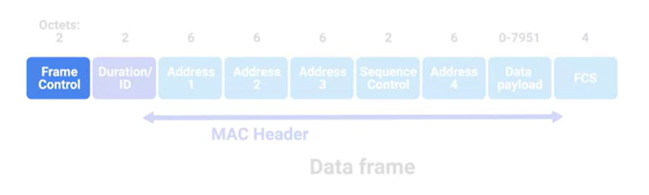
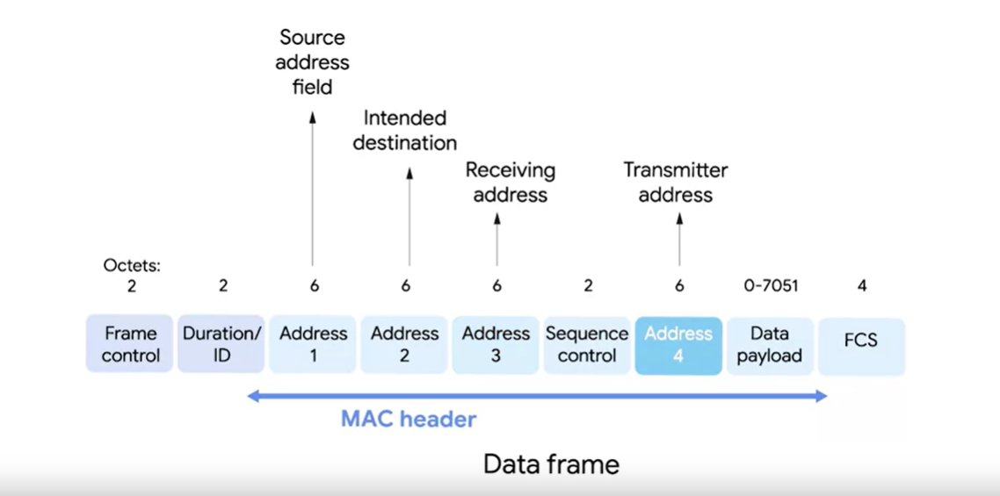

# Introduction to Wireless Networking Technologies

The most common specifications for how wireless networking devices should communicate are defined by the IEEE 802.11 standards. This set of specifications, also called the 802.11 family make-up the set of technologies we call Wi-Fi. Wireless networking devices communicate with each other through radio waves. Different 802.11 standards generally use the same basic protocol, but might operate at different `frequency bands`.

### **Frequency band**

A certain section of the radio spectrum that's been agreed upon to be used for certain communications.

> In NA, FM radio transmissions operate between 88 and 108 MHz.

`Wi-Fi networks operate on a few different frequency bands, most commonly the 2.4 gigahertz and 5 gigahertz bands.`

802.11 specifications:
- 802.11b
- 802.11a
- 802.11g
- 802.11n
- 802.11ac

> 802.11 = physical and data link layers

- **Frame control field**: 16 bits long and contains a number of subfields that are used to describe how the frame itself should be processed.
- **Duration field**: It specifies how long the total frame is, so the receivers knows how long it should expect to have to listen to this transmission.

> `Wireless access point`  
A device that bridges the wireless and wired portions of a network.

There are four address fields, because there needs to be room to indicate which wireless access point should be processing the frame.

- **Receiver address**: The MAC address of the access point that should receive the frame.
- **Transmitter address**: The MAC address of whatever has just transmitted the frame.
- **Sequence control field**: 16 bits long and mainly contains a sequence number used to keep track of the ordering of frames.
- **Data payload**: Has all of the data of the protocals further up the stack.
- **Frame check sequence field**: Contains a checksum used for a cyclical redundancy check, just like how Ethernet does it.
- **Frame control field**: 16 bits long and contains a number of subfields that are used to describe how the frame itself should be processed.