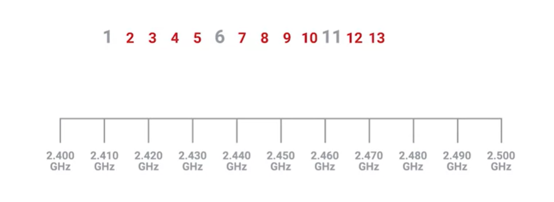
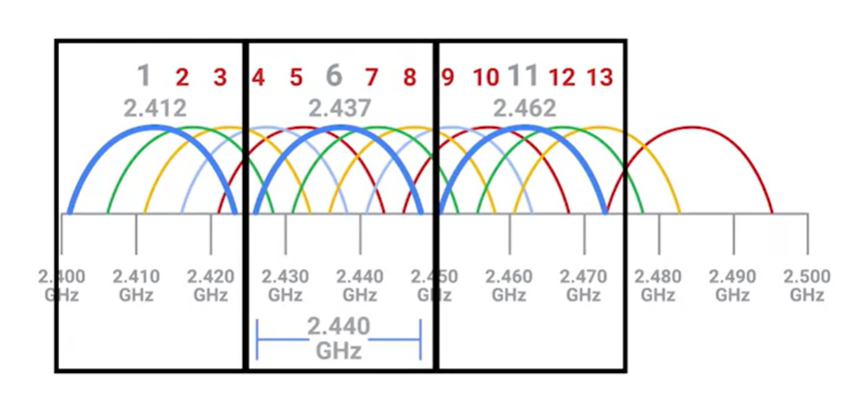

# Wireless Channels

> `Channels`  
Individual, smaller sections of the overall frequency band used by a wireless network.

Wireless network doesn't have a switch to know the physical address of each node so it needs channels to fix this problem to a certain extent. 

When discussing the 2.4GHz wifi frequency band, it mean that they operate on roughly the band from 2.4 gigahertz to 2.5 gigahertz between these two frequencies are a number of channels, each with a width of a certain megahertz.

Radio waves are imprecise things so you need some buffer around what exact frequencies a transmission might actually arrive on.

